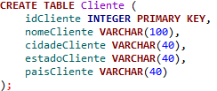
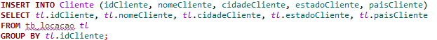
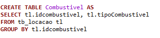
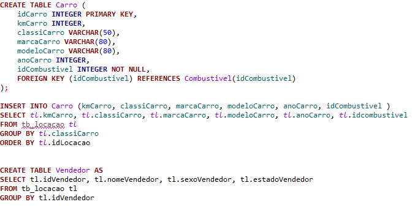
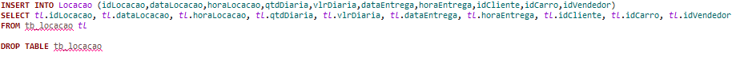
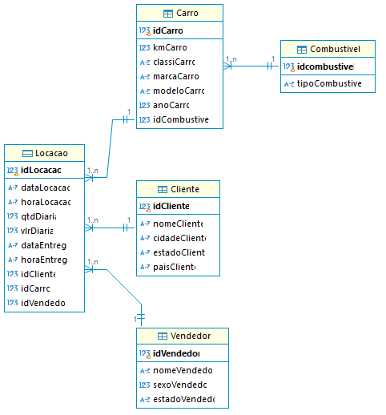
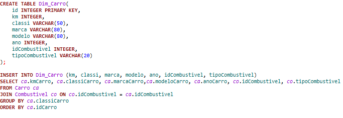
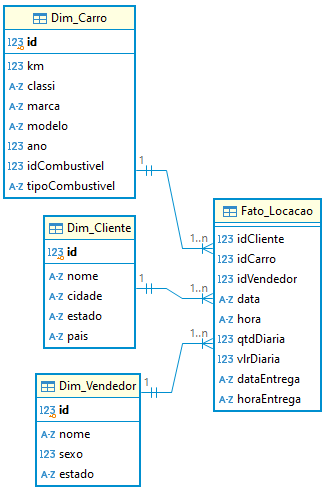

# Desafio

## Etapa 1 - Normalização e Modelo Relacional

O começo para realizar o desafio foi vendo o que me foi dado, uma tabela com todos os atributos e dados de um banco de dados nela, partindo disso eu resolvi criar cada tabela para receber o atributo certo, mas tudo vindo da tabela original entregue para realizar o desafio.

Começo com a tabela cliente, uma tabela em que só teria a chave primária e atributos próprios.

Depois de criar a tabela, já inseri os dados de cada atributo usando o *select* na tabela original, há *tb_locacao*.

Seguindo com o resto do código, fui fazer a tabela combustível. Para a criação dela usei outra forma de criar, uma forma que quando cria a tabela já manda a os dados dos atibutos juntos.

Em seguida, fiz a tabela carro, já que ela precisava de uma chave estrangeira para ser criada, e usei o método de criação igual da tabela cliente, cria a tabela depois insere os dados com select. Aproveitando a criação da tabela carro já criei a tabela vendedor, usando o método de criação igual da tabela combustivel, cria a tabela e já insere os dados com select.

Com o término das tabelas únicas ou com pouco dependência, fui recriar a tabela locação, agora mais organizada e com ligação as outras tabelas, e a forma como criei ela foi igual a da tabela cliente. Terminando de criar todas às tabelas e suas ligações, fui deletar a tabela original, visto que agora ela não tinha mais serventia, já que todos os atributos e dados contidos nela já estava devidamente organizado em cada tabela e atributo.

Concluindo todo este serviço, o banco de dados final ficou normalizado e com seus relacionamentos feitos.

## Etapa 2 - Modelo Dimencional

Na criação do modelo dimenciona foi sugerido a utilizar a função *view* para criar as views e assim conseguir ter o modelo dimencional. Fazendo com que tivesse as tabelas dimenção e as tabela de fato, para que o modelo dimencional ficasse interligado.

O modelo dimencional segue a mesma criação do modelo relacional, foi optado por criar o modelo dimencional por tabelas, por conseguir criar as tabelas dimenção e fato com relacionamento, já que com a opção de criar esse modelo com as views não daria para fazer os relacionamentos no mesmo IDE escolhido.

Exemplo de criação do modelo dimencional na forma de tabela.

Com o termino de criar e inserir dados em cada tabela dimenção e fato, tem o modelo dimencional.

