# Desafio
## Etapa 1
Para iniciar o desafio, tive que instalar o docker descktop para consegui realizar o desafio, além de lembrar qual versão python já tinha instalado. Feito tudo isso já poderia começar a realizar o desafio.

Iniciando o desafio, era criar o arquivo *DockerFile* para criar a imagem e rodar o container do arquivo *carguru.py*.

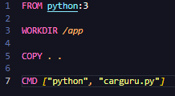

Depois de criar o arquivo, já fui para o terminal da pasta do arquivo e comecei a criar a imagem.
Nessa primeira parte usei o terminal do projeto no Visual Studio Code.

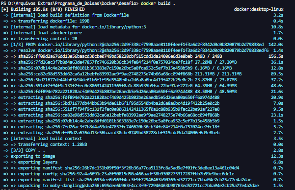

Logo após criar a Imagem, fui atrás para saber o ID da imagem e assim conseguir criar e rodar o conteiner já com o nome *ImageDesafio*. Aqui no meu caso, o conteiner foi criado e já liberou o __ID do conteiner__, o que já aproveitei os 4 primeiros algaritimos para parar ele e ir para a etapa 2 do desafio.

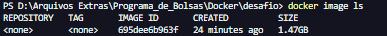

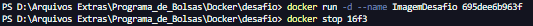

## Etapa 2

Com o término da etapa 1 do desafio, já vendo que consegui rodar o conteiner, decidi parar ele e ver se conseguia rodar ele de novo, sem ter que criar uma nova Imagem. Os comandos para fazer o conteiner parar foi o *docker stop __ID ou nome da imagem__*, assim fará o conteiner antes rodando parar e possibilitando a tentativa de reusar o conteiner já criado, tentando voltar a rodar o conteiner só usar o comando *docker start __parâmetro, se achar necessário__ __ID ou nome da Imagem__*. Se o comando retornar o nome da imagem, se houver, ou o ID dela. O conteiner conseguiu ser reutilizado. O que foi o meu caso.

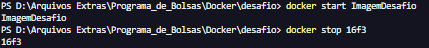

Conseguindo isso já fui tentar rodar ele mandando a saida no terminal provando que além de rodar o conteiner 2 vezes, agora além de retornar o nome na imagem, estaria retornando o resultado do programa *carguru.py*

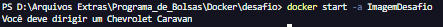

## Etapa 3

Com o fim da etapas 1 e 2, comecei a realizar a etapa 3 com certo diferencial, primeiro era o aprendizado de o que é uma hash da string por meio do algoritmo SHA-1, mas isso foi logo solucionado quando vi que era só importar uma biblioteca nativa do python e 2 linhas no código. Com o aprendizado dessa dificuldade consegui criar o arquivo python que usaria nessa etapa.

O arquivo python ficou assim.

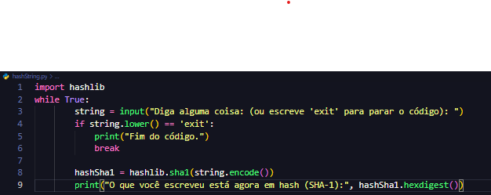

Assim que finalizei o código python, fui fazer o arquivo docker que era igual ao criado na etapa 1, só que com o diferencial no nome do arquivo python que será rodado.

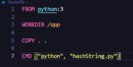

Indo para a execução da etapa 3 no terminal começa com a criação da imagem, e nessa etapa do desafio decidi realizar os comandos *docker* no ambiente virtual *CodeSpace* do git hub, aproveitei para ver se tinha algum conteiner criado no local, e depois de verificar que não tinha nada fui criar a imagem.

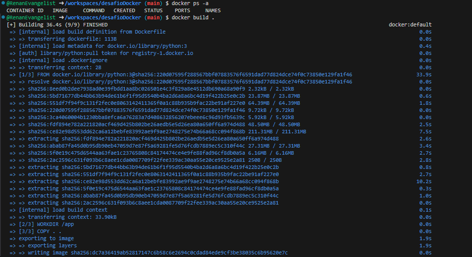

Depois de criar a imagem, é o momento de criar o conteiner e vê se ele rodaria o programa. O que fiz para rodar a imagem foi, achar o id dela, depois usar o comando *docker run* e usar o parâmetro *-it* para eu conseguir ver o código no terminal e interagir com ele, e já fiz a nomeação do conteiner para o que o desafio pede, sendo ele *mascarar-dados*.

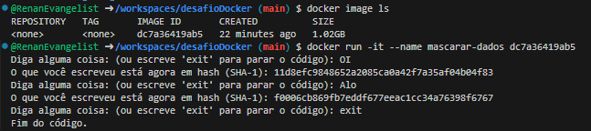

Feito tudo isso e visto que o conteiner rodou com sucesso, chegou a parte de parar ele, e isso só foi usar o comando *docker stop __nome do conteiner__* e pronto, o conteiner parou de funcionar.

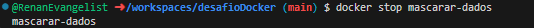

Para finalizar o desafio por completo, rodei o conteiner de novo para ver se rodaria por uma 2° vez, e consegui esse feito.

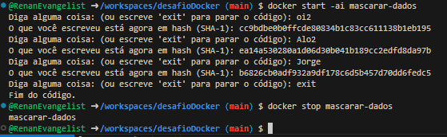
