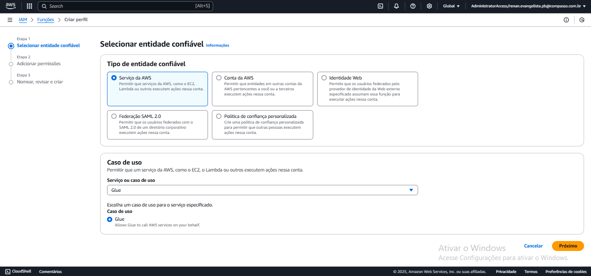

# Sprint 7
### Informações
Nessa sprint o foco foi realizar a 2° entrega do desafio final do programa de bolsas, usando conhecimentos de antigas sprints. A sprint começou com o aprendizado de Spark, que serviria para realizar um dos exercícios, e nessa sprint não teve nenhum curso da AWS para ser aprendido. Além desse curso de Spark, foi aprensantado a API que usaria no desafio, e o console do GLUE, tudo sendo apresentado como exercício, ambos os exercícios tiveram sua dificuldade em ser realizado, principalmente o GLUE. Além dos exercícios, o desafio dessa sprint teve sua dificuldade, sendo que usaria conhecimento de sprint passada e a escolha que teria para dados que faria parte dos arquivos JSONS.
### Certificados
Nesta sprint o foco foi em curso proporcionado pela Udemy, sem ter envolvimento com nenhum curso da AWS. Isso fez com que a pasta certificados fique vázia nessa sprint.

### Desafio
O desafio desta sprint é a continuidade do *Desafio Filmes e Séries*, focado na construção de um Data Lake com as etapas de Ingestão, Armazenamento, Processamento e Consumo. O tema central da minha análise é a trajetória das animações e comédias brasileiras, abordando sucessos passados e atuais, com destaque para séries e dubladores. Foram formuladoas perguntas sobre as melhores comédias e animações lançadas entre 1980 até dias atuais, seus derivados, a popularidade das séries e os dubladores mais influentes. 

A segunda entrega focou na API The Movie Database (TMDB), que foi utilizada para obter dados de filmes e séries, criando um arquivo JSON a ser armazenado na AWS S3. O processo incluiu a criação de uma layer com a biblioteca TMDB, o upload no Lambda, ajustes na donfiguração para evitar erros e o envio do arquivo para o bucket. O código foi estruturado em duas funções: uma para usar a API TMDB e gerar os arquivos JSON's com até 100 registros, e outra para enviar o arquivo ao bucket do AWS S3. A configuração IAM foi ajustada para permitir o upload e, ao final, os arquivos JSON's foram gerados com sucesso, organizados por comédia e animação, conforme os parâmetros definidos

- [Desafio](./desafio/)

### Evidências
O resultado que obitive realizando o desafio, sendo criando os sripts necessários e os resultados das ações dele. Tudo em forma de imagenm para ser usado no *readme* do diretório *desafio*.
### Exercícios
Nesta sprint os exercícios foram 3, sendo eles, um se baseando em Spark, outro adquirir a chave da API TMDB para o desafio, e o AWS GLUE. Na pasta de exercício foi dividido em 3 sub-pasta, para não se misturar as evidências de resolução dos exercícios.

##### Spark

- [Spark](./exercicios/Spark/)

- [Exercício de Spark Código](./exercicios/Spark/exercicioSpark.ipynb)

No exercício do Spark, para resolver ele teria que começar no terminal e usando o docker. Indo para o terminal e colocando o comando docker para puxar uma imagem já existendo que se baseava no jupyer notebook, onde seria executado pelo conteiner.

Com a importação da imagem feita com sucesso, só foi rodar ele no container, específicando volume e porta para conseguir abrir a página web.

Com o conteiner rodando, ele conseguiu abrir uma página web sendo ela a jupyter notebook.

Estando agora no Jupyter Notebook, chegou o momento de criar o código que serviria para ler o arquivo readme pronto, da sprint 6, e contar quantas vezes cada palavra foi usada. No código no Notebook, começei importando o Pyspark.

Depois de importar o Pyspark, só precisou criar a variável *spark* que serviria para a lógica da contagem de palavras.

E com ela criada, só faltou criar a lógica do código, ela começa quardando o arquivo readme numa variável, depois só foi usar essa variável para mapear o arquivo readme, separar palavra por palavra, e ver se ela já apareceu e somar na contagem, tudo isso feito por funções Lambda, já que não seria necessário criar uma função, e elas estão guardadas com tuplas, primeiro a palavra e depois a contagem dela, com o fim de tudo só foi guardar todas as tuplas em uma variável, e mostrar a coleção que ficou.

Com o termino do exercício, só foi necessário voltar no terminal que estava rodando o conteiner e parar ele, com o comando *Ctrl+C*, e mostrando que o conteiner parou.

##### API The Movie DataBase
- [The Movie DataBase](./exercicios/Tmdb//)

Nesse exercício, ele se baseou em conseguir a chave da API Tmdb para usala no desafio, e para isso teria que seguir as orientações que está no slide dele na parte de exercício TMDB, e no fim conseguir a chave e o executar no código de exemplo para ver se funciona. O que funcionou certinho

##### AWS GLUE
- [AWS GLUE](./exercicios/Glue/)

- [Exercício de Glue Código](./exercicios/Glue/exercicioglue.py)

Nesse exercício foi onde demorei para resolve-lo tudo graça a complexidade de como ele é para se terminar, mas as orientações que obtive com o pdf que vinha foram muito objetivas e quando tinha dúvidas que o arquivo não respondia, tirava com o monito.

Além de tudo isso, o exercício de glue se baseou realizar uma ETL dentro do glue, só que para isso teria que seguir passo a passo das orientações do arquivo pdf para configurar o glue e conseguir criar o arquivo python que resolveria as perguntas da etapa 5.2 do arquivo pdf.

Começando a resolver o exercício parte com a importação do arquivo CSV no bucket , escolhi o bucket *renan.exercicio.example.com/lab-glue/* de exercícios já criado sprints passadas, por praticidade e já estar pronto.

Depois de colocar o arquivo no bucket *renan.exercicio.example.com/lab-glue/*, fui criar a Role IAM que serviria para o GLUE. Na criação dessa Role, *AWSGlueServiceRole-Lab4*, ela teria que ter 4 policies nelas sendo AmazonS3FullAccess, AWSLakeFormationDataAdmin, AWSGlueConsoleFullAccess e
CloudWatchFullAccess, essas policies servem para o Glue acessar o Bucket S3 além de executar códigos via *Notebooks*, e com isso tudo feito, o perfil já estava pronto.

Nessa parte é onde configuro o Glue para que se possa utilizar o serviço com as permissões necessárias.

Depois de configurar o Glue, as orientações do arquivo pdf foram para ir a AWS Lake Formation para realizar um banco de dados no qual o crawler, será criado depois, irá adicionar automaticamente uma tabela com as informações que está no Bucket S3.

Com o banco de dados criado, voltei para o Glue e foi criar o Job que rodaria o arquivo Python. As configurações do job foram instruidas pelo arquivo pdf do exercício, com a única modificação sendo no caminho de input e output dos arquivos no bucket. Único contratempo foi ter que criar a pasta *frequencia_registro_nomes_eua* antes de ir para o código no job, já que ele seria necessário para a saida de informação do código.

Com a configuração do Job no Glue feito, só foi criar o código que seria usado. Esse código se baseia na etapa 5.2 do arquivo de pdf do exercício, e teria que resolver cada item com base no arquivo CSV guardado no bucket.

Na lógica desse código, não foi muito difícil faze-lo, a maior dificuldade foi sincronizar o input e output das informações contidas no bucket, já que não tinha colocado as variáveis de *INPUT_PATH* e *OUTPUT_PATH* na variável *args* no início do código.

Com o sucesso do job do Glue, ele foi capaz de criar os diretórios específicos no bucket com os arquivos que são os resultados de cada tópico da etapa 5.2 das orientações.s

Na parte final do exercício de Glue, era só criar um mecanismo Crawlers para utilizar como monitoramento do armazenamento de dados para criar, ou atualizar, metadados no catálago do Glue, tudo isso de forma automática.

O Crawler já criado, só precisou ir na AWS Athena ver se a tabela com base no dados do bucket foi feito e retornaria um resultado no *SELECT*.

E com o resultado final no AWS Athena, mostraria que o exercício Glue foi feito com sucesso.