# Sprint 8
### Informações
Nessa sprint o foco foi em resolver os exercícios usando Spark e realizar a 3° entrega do desafio final do programa de bolsas, tudo isso usando conhecimentos de antigas sprints. A spirnt começou com a realização dos exercícios de Spark, que foram realizados no google colab. Além dos exercícios, o desafio da sprint foi reformular as perguntas para análise na próxima sprint e realizar a conversão dos arquivos CSV e JSON para PARQUET.
### Certificados
Nesta sprint o foco foi em curso proporcionado pela Udemy, sem ter envolvimento com nenhum curso da AWS. Isso fez com que a pasta certificados fique vázia nessa sprint.

### Desafio
O desafio da sprint é a continuação do Desafio Filmes e Séries, focado na construção de um Data Lake com etapas de Ingestão, Armazenamento, Processamento e Consumo. A análise abordou séries brasileiras de comédia e animação, formulando perguntas sobre sucessos, dubladores e novas produções. Na terceira entrega, o foco foi tansformar arquivos CSV e JSON da pasta RAW para o formato PARQUET usando AWS Glue e Apache Spark, armazenando-os na pasta TRUSTED do bucket *renan-desafio-filmes-series-2024*. O processo envolveu criar e configurar jobs no Glue para conversão dos arquivos e organizar a saída no S3. Após ajustes nos scripts Python, os arquivos foram processados corretamente. Para validar os dados, foram criados Crawlers no AWS Glue para catalogação e consultas no aWS Athena, garantindo a integridade e acessibilidade dos dados.

- [Desafio](./desafio/)

### Evidências
O resultado que obitive realizando o desafio, sendo criando os sripts necessários e os resultados das ações dele. Tudo em forma de imagenm para ser usado no *readme* do diretório *desafio*.
### Exercícios
Nesta sprint os exercícios foram 3, 2 com base no Spark e outro sendo um mesmo exercício da sprint 7.

#### Spark
Esses exercícios de Spark foram feitos todos no Google Colab, já que numa orientação da sprint 7, mostrava que no Colab conseguiria utilizar o pyspark com mais facilidade.

- [Spark](./exercicios/Spark/)

##### Geração em Massa de Dados

- [Exercício Geração em Massa de Dados](./exercicios/Spark/GeracaoMassaDados/GeracaoMassaDados.ipynb)

Nesse exercício, fui instruido a criar um código python em um ambiente da minha escolha, e da minha escolha, então fui fazer ele no Colab. No Colab a primeira e a segunda etapa é um aquecimento para realizar o desafio, a primeira sendo para criar uma lista com 250 inteiros, ordenar eles aleatoriamente e depois reverter a ordem dele.

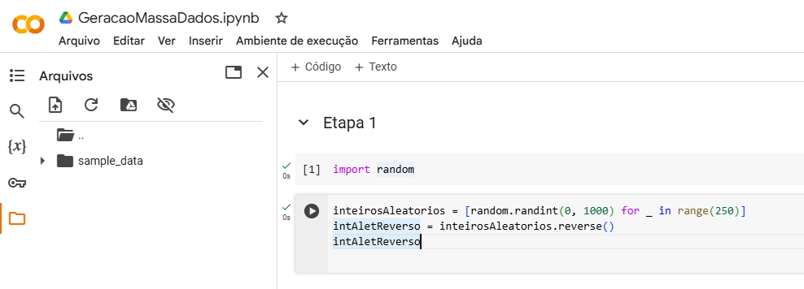

Na segunda etapa, foi preciso criar uma lista de 20 animais diferentes, apresentar ela, e depois armazenar essa lista em um arquivo csv.

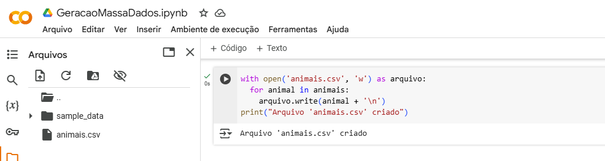

Na terceira etapa começa o exercício, nele quemos que instalar as bibliotecas, importar elas e definir a quantidade de nomes únicos.

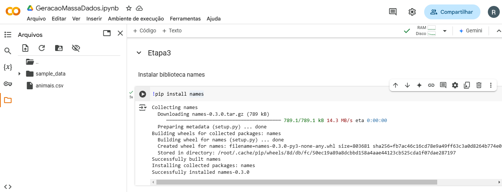

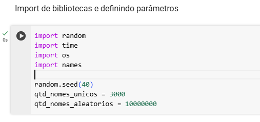

Com tudo isso feito, só foi necessário pegar os nomes únicos e aleatorizar o nome para deixar eles aleatórios e depois guardar eles em um arquivo txt.

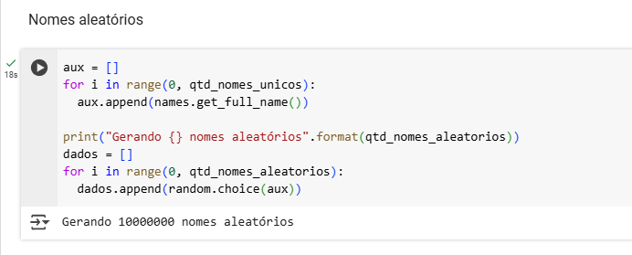

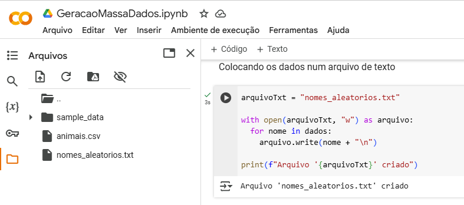

Com a criação do arquivo txt, contendo os nomes aleatórios, concluí esse exercício.

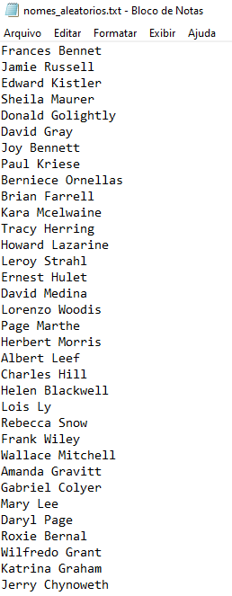

##### Apache Spark

- [Exercício Apache Spark](./exercicios/Spark/ApacheSpark/AparcheSpark.ipynb)

Nesse exercício, fui instruido a criar um código python em um ambiente da minha escolha, e da minha escolha, então fui fazer ele no Colab. No Colab a primeira etapa é para pegar o arquivo txt criado no exercício anterior, instalar o pyspark, fazer a sessão spark e criar a coluna de nomes, mostrando o top 5 dele.

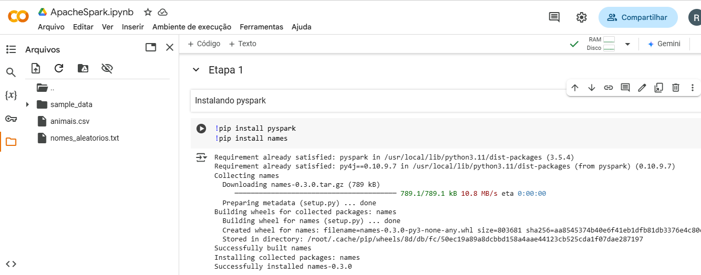

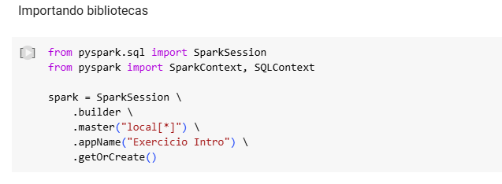

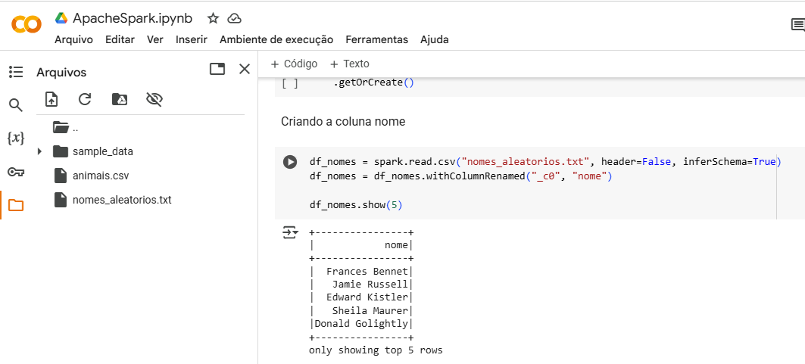

Na etapa 2, começa mostrando o tipo do dataFrame nomes, sendo *string*, e depois arrumar o nome da coluna, mostrando o top 10.

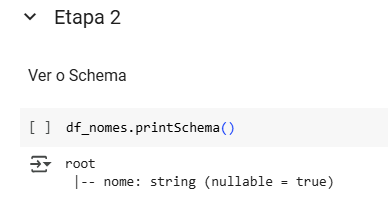

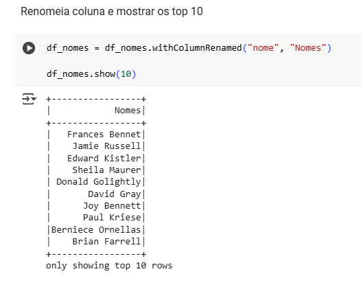

Na etapa 3, ela se baseia em criar uma coluna no dataFrame nomes, agora sendo a escolaridade. Aqui tive uma dificuldade em como colocar a escolaridade de uma forma igual, a única que tive foi pegar um número aleatório entre 0 e 1 e separar em 3(fundamental, médio e superior)  para que possa colocar de forma igual o nível de escolaridade. 

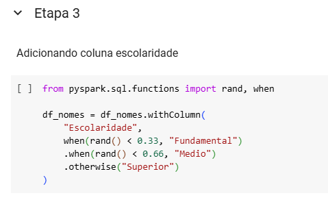

Na etapa 4, se baseia em criar mais uma coluna no dataFrame, agora sendo a de país, nela a dificuldade foi como colocar a os países de uma forma aleatória, e a única solução que tive foi, criar a coluna *"Países"* com números aleatórios, depois for definir esses números aleatórios como país, e para isso só foi enumerar a lista de países para que cada número na coluna ser preenchido pelo mesmo número da lista de países.

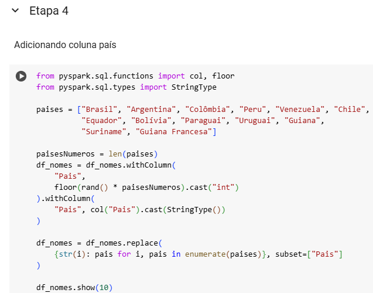

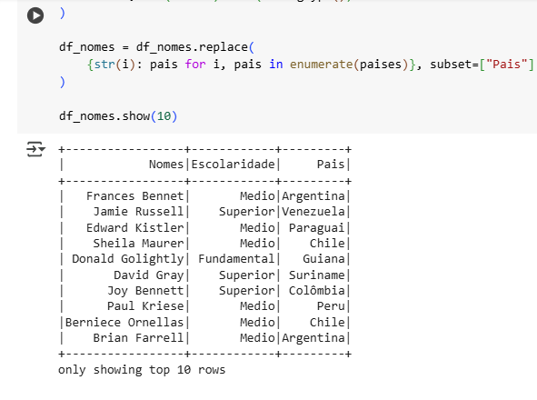

Na etapa 5, se baseia em criar mais uma coluna no dataFrame, para criar essa nova coluna importei duas funções para poder criar a coluna AnoNascimento, nela os anos que deveria aparecer seria de 1945 até 2010, e colocar na coluna de forma aleatória. Tudo isso foi feito sem muitas dificuldade.

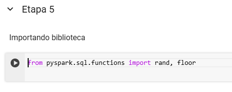

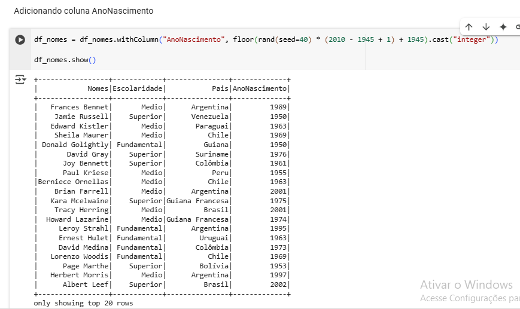

Na etapa 6, se baseou em mostrar todas as pessoas que nasceram no século XXI, isso no spark.

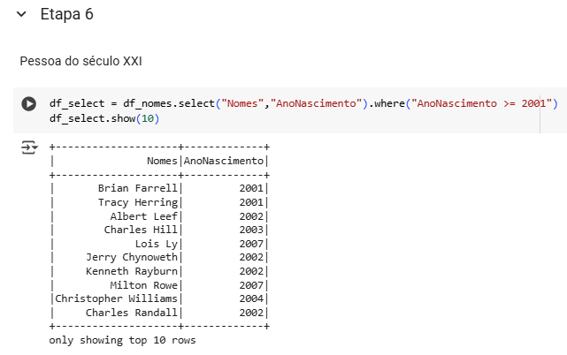

Na etapa 7, se baseou em mostrar todas as pessoas que nasceram no século XXI, só que agora no formato SQL.

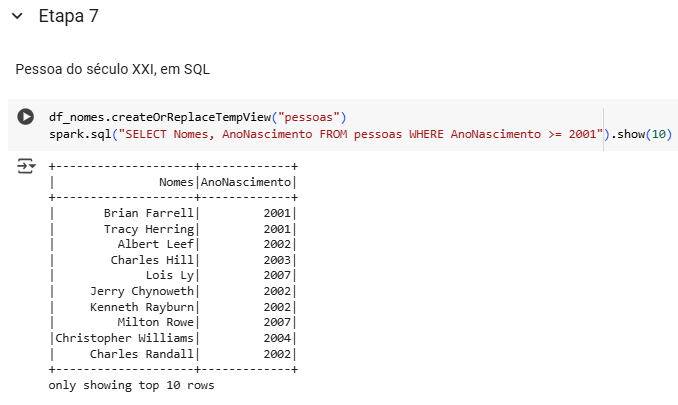

Na etapa 8, foi para fazer a mesma ideia da etapa 6 só que para fazer a contagem de pessoas que nasceram nessa época.

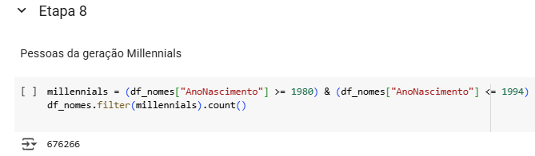

Na etapa 9, foi para fazer a mesma ideia da etapa 8 só que agora no formato SQL.

Na etapa 10, só foi realizar uma nova apresentação de países, só que agora criar duas novas colunas, uma que seria *"Geração"* e outra *"Quantidade"*, a de geração teria que combinar com a limitação de cada geração, e a quantidade era para fazer a contagem dessas pessoas de cada geração em cada país, e dopois ordenar pelo país e geração.

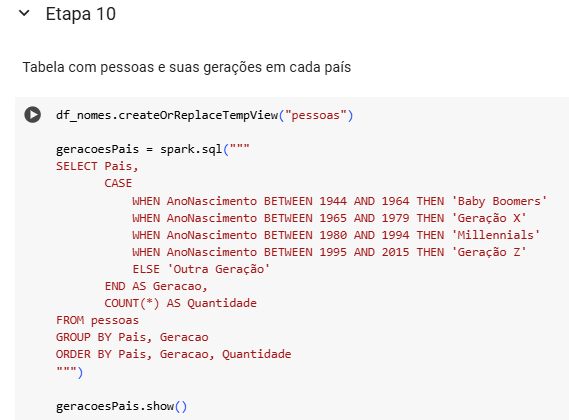

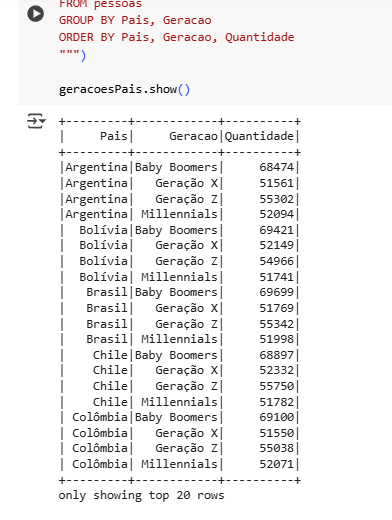
#### API The Movie DataBase

- [The Movie DataBase](./exercicios/Tmdb//)

Nesse exercício, ele se baseou em conseguir a chave da API Tmdb para usala no desafio, e para isso teria que seguir as orientações que está no slide dele na parte de exercício TMDB, e no fim conseguir a chave e o executar no código de exemplo para ver se funciona. O que funcionou certinho

