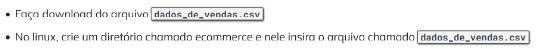
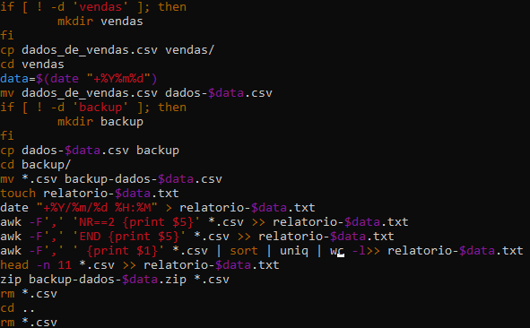
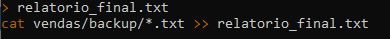
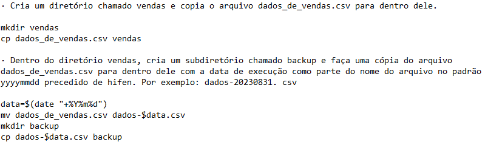
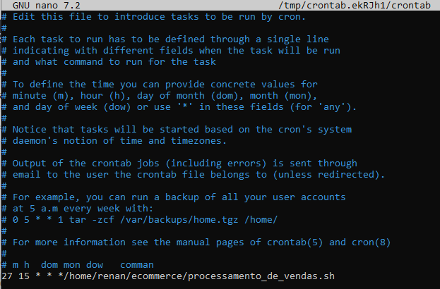
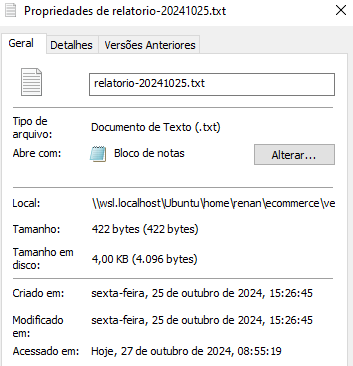
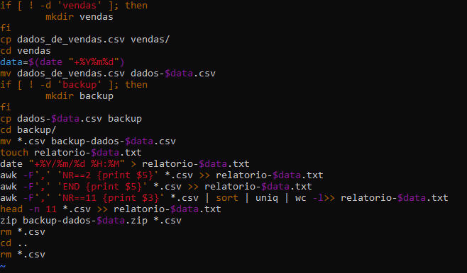
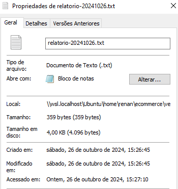

# Desafio
### Passo a passo
Para começar a rodar o código do desafio tem que realizar os preparativos apontados nos slides disponíveis.
_foto do preparativos do desafio_

Assim para rodar o código *processamento_de_vendas.sh*,  segue a segunte ordem:
- Entra na pasta _ecommerce_ agora já preparada
- Nele, poderá colocar o arquivo *processamento_de_vendas.sh*
- Para rodar o arquivo *processamento_de_vendas.sh* com o comando *bash processamento_de_vendas.sh* no terminal da pasta *ecommerce*.

Realizando estes passos, atenderá aos preparativos propostos na apresentação do desafio e poderá efetuar o funicionamento do programa e gerar as pastas solicitadas, junto com a transferencia, renomeação e zipagem do arquivo *dados_de_vendas.csv* e obter um relatorio com as caracteristicas necessárias.
*Foto do código processamento_de_vendas*

Para rodar o código *consolidador_de_processamento_de_vendas.sh* terá que realizar mais do que uma execusão do código *processamento_de_vendas.sh*. Para isso poderá copiar um relatório já realizado e colar ele, tudo isso na pasta onde o relatório está.
Assim que tiver dois relatórios feitos, poderá rodado o arquivo *processamento_de_vendas.sh* e unir os relatórios já feitos em um só, e para rodar o código é:
- Pode rodar o arquivo *consolidador_processamento_de_vendas.sh* com o comando *bash consolidador_processamento_de_vendas.sh* no terminal da pasta *ecommerce*.

Realizado a execução do programa, ele te entregará um relatório final com a junção dos relatórios feitos pelo arquivo *processamento_de_vendas.sh*.
*Foto do código consolidador_processamento_de_vendas*

### Início
Começei a realizar o desafio, lendo a propósta dele e tentando divir ele em partes e resolver ele aos poucos. Teve momentos em que criei dúvidas sobre como realizar certa propósta do desafio, mas resolvi minhas dúvidas questionando ela para minha monitora e colegas da turma, e tentando resolver ele isoladamente sem a necessidade de envolver partes anteriores do código.
Isso tudo fez com que eu conseguisse entender melhor o desafio e resolver ele.
_Foto do arquivo txt resolvando o desafio_

[Resolução do Desafio](../evidencias/ResoluçãoDireta.txt)
### Meio
Na metade da resolução do desafio me deparei com o problema de realizar o funcionamento do programa com um agendamento. E o problema era programar a realização do _crontab -e_ no horário específico, mas mesmo colocando ele para rodar, ele rodou com atraso de menos de 15 segundos, mas todos os resultados do programa foram entreque na mesma hora, minuto e segundo, com diferença de exatos 1 ou 2 segundo em certos arquivos mas todos na média de 45 segundos.
_Foto do crontab e do resultado_

Outro problema apresentado no decorrer do tempo, foi a contagem dos itens únicos da lista de produdos vendidos, nos dois primeiros dias segui uma lógica de caracterizar a contagem diferente na do dias restantes, essa segunda análise na lógica do programa se deu graças a turma relatando o resultado de seus programas e a minha checagem de última hora no código já escrito e rodando nos três primeiros dias.
O problema da contagem de itens únicos foi por uma seleção diferente na hora de contar os itens, a que foi usado nos primeiros dias tinha o erro de usar a categoria "quantidade" e começar na linha 11 a leitura, mas tendo que usar a categoria "id" e não definir linha, para assim realmente contar quantos produtos tinham sido vendidos.
_Foto do código errado_

### Final
No momento final do desafio, e fim da execução dos 4 dias seguidos, o programa estava em seu perfeito estado e rodou seu último dia criando o arquivo da forma certa, sem nenhum problema e gerando o resultado esperado.
_Foto do último relatório feito_

