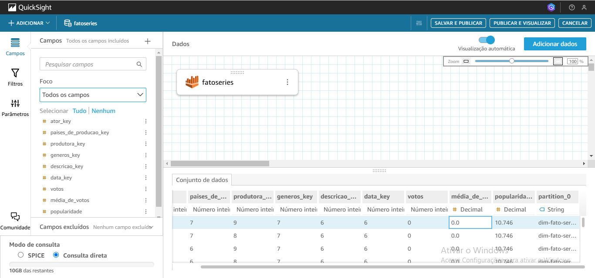
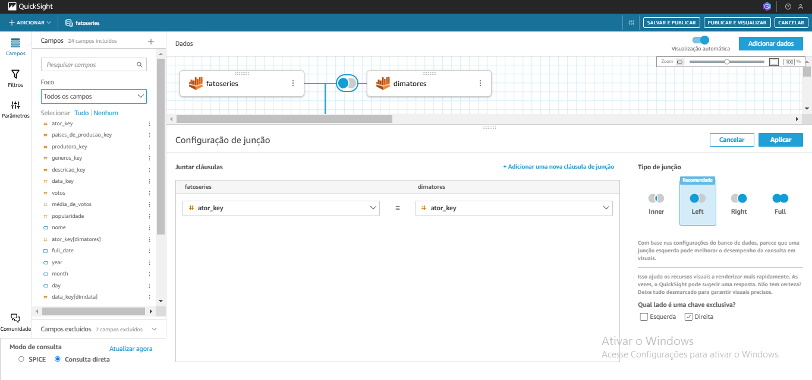
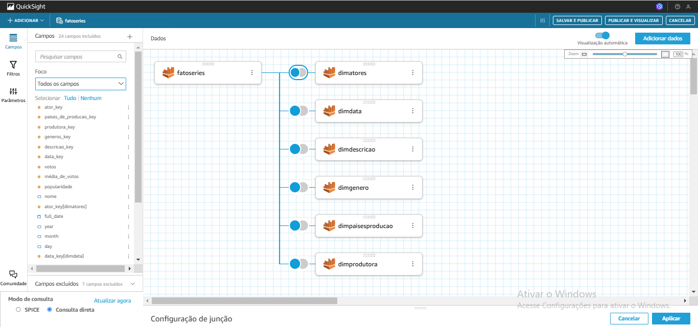
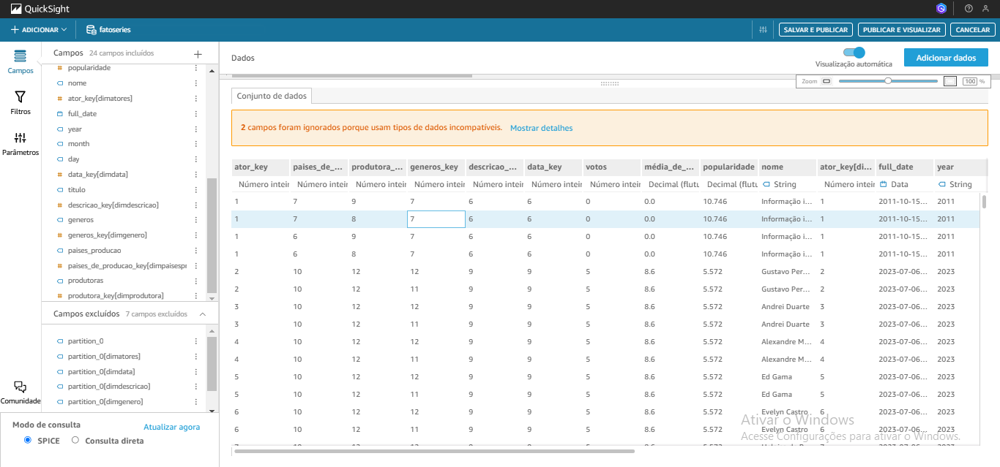
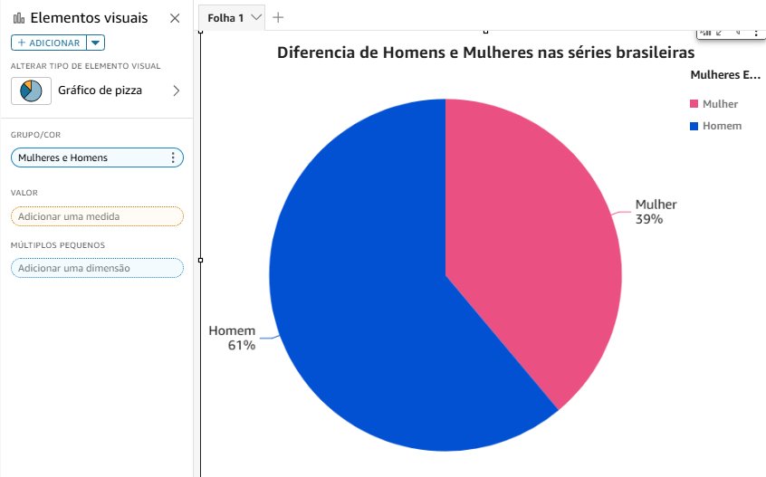
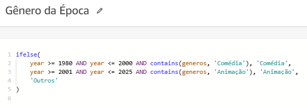

# Desafio
O desafio dessa sprint é a finalização do desafio da spint 6, em que ambos fazem parte do desafio final ou *Desafio Filmes e Séries*, que se baseia em construir um Data Lake, com as etapas de Ingestão, Armazenamento, Processamento e Consumo.

### Quinta entrega

Na quinta, e última entrega do desafio filmes e séries, ele se baseia em criar um dashboard com as informações que estão em forma de tabelas no bucker *renan-desafio-filmes-series-2024* na camada Refined, e esse dashboard seria feito no QuickSight.

Antes de começar a criar o dashboard, eu tive que criar uma conta no QuickSight. E para criar a conta teria que seguir as instruções que foram instruidas nos slides dessa sprint.

O primeiro passo para criar a conta é seguir dois passos, definir o *Authentication method* como *Use IAM federated identities only* e selecionar a região *US East (N. Virginia)*.

Feito esses dois primeiros passos foi colocar o nome da conta do QuickSight, como *renanevangelistapb* já que era pra usar o mesmo nome do email corporativo, e depois deixar as IAM Role como *default*.

Depois disso, foi selecionar os acessos pemitidos, e aqui eu já decidi colocar o bucket do desafio do S3 selecionado, e deixar o resto dos acessos padrões como estão.

Com o termino de selecionar os acessos, foi a parte mais importante da conta, é deixar a opção *Add pixel-perfect Reports* __desmarcado__ já que isso é inútil para resolver o desafio e nas orientações do desafio, está bem claro que é para deixar isso desmarcado.

Depois de realizar todos esses passos para criar a conta do QuickSight, só foi criar ela e já começar a realizar o dashboard.

Com a conta já feita foi a hora de criar o dash, mas antes teria que importar os dados para a consulta de dados que vão ser usados no dashboard.

Para importar os dados para o serviço do QuickSight, tem que se criar uma *Nova análise*.

Essa nova análise teria que puxar os dados do Athena, já que lá consta as tabelas da modelagem dimensional já feitas, graças a spirnt 9.

Abrindo a fonte do Athena pede o nome da fonte, que coloquei *Tabelas Dimensionais*, e depois é criar a fonde de dados

Com o nome já feito, só foi necessário selecionar o banco de dados que vai usar, selecionei o *refined-database*, já que lá está minhas tabelas da modelagem dimencional, e selecionei a tabela principal, a fato séries, já que ela que vai ligar com todas as outras tabelas dimencionais.

Selecionando a tabela fato, opitei por importar para SPICE e já editar/pré-visualizar dados para colocar o resto das tabelas do modelo dimencional.

Abrindo o Editar/pré-visualizar dados, mostrou que consegui importar a tabela fatoseries do AWS Athena e os dados que consta nele estão lá. Depois disso cliquei em *Adicionar dados* para adicionar as outras tabelas.

Aqui já selecionei o banco de dados *refined-database* e selecionei todas as tabelas dimencionais que consta nela.

Com as tabelas importadas elas já vieram ligadas para a tabela *fatoseries*, só que não mostrava que tipo de join elas tinham. De primeira tentativa, escolhi todos os joins como *Full Join* e selecionando as chaves de cada uma das dimensões para as chaves delas que consta na tabela *fatoseries*.

Segui essa forma de join para todas as dimensões, e selecionei as chaves PK das dimensões com as FK da tabela fatoseries até a última.

Só que, quando fui fazer o dashboard, senti uma dificuldade em criar os gráficos da forma que precisava. E voltei para criar um novo conjunto de dados só que agora com cada join das tabelas com *Left Join*, já que a chave exclusiva está na tabela de dimensões, assim arrumei todos os joins das relações.

Com o termino do ajuste das relações das tabelas, ficaram todas com o tipo de junção *Left Join*.

Indo para ver como ficou as informações do conjunto, já aproveitei para colocar o tipo de dado correto para certas colunas, como as de *year, month e day* para string, removi as colunas *partition_0* de cada tabela, porque foi criada trazida por engano. E com o termino desse ajuste extra só foi *Salvar e Publicar* o novo conjunto de dados e depois visualiza-lo para criar o dashboard, que é só clicar em *Publicar e Visualizar*.

Indo agora criar o dashboard, escolhi a forma padrão de planilha e com o tamanho padrão.

Terminando a 2° etapa, a 3° etapa se baseia na mesma lógica dela, só que agora com séries seriam no foco de gênero animação e do período de 2001 até 2025. Com essa mudança feita só foi criar os mesmos gráficos e trocar o foco de gênero e período deles, mas seguindo a mesma order e de gráfico da etapa 2.

Assim termina o meu dashboard, seguindo a linha de primeiro apresentar os gêneros das séries e o país de produção deles, depois mostra qual é as melhores séries e quantas séries cada autor fez com foco em uma gênero específico de série e em um período específico. -->

Na forma como esse dash será feito, tive dificuldade em apresentar os dados já que muitos dos dados só conseguiriam ser apresentados em certos gráficos e em certas condições. Mas depois de muita análise e tentativa e erro consegui criar o dashboard com foco no tema __A trajetória das animações e comédias brasileiras: dos maiores sucessos às novas gerações de séries.__

Com esse foco para alcançar, fui fazer a 1° linha de gráficos do dashboard, ele se baseia em dois gráfios, um de pizza e outro em rosca, mas ambos mostram o foco do que vai ser análisado no dashboard. 

Indo para o gráfico de pizza, ele aborda as séries que contem foco nos gêneros específicos, como séries focada em animação e série focada em comédia. Isso compoem as 2 fatias do gráfico e a 3° fatia seria a junção dos gêneros restantes. Aqui também contêm uma interação, em que mostra o *Foco no gênero*, em que se clicar nele foca a análise com base nesse gênero.

Indo para o gráfico ao lado desse, seria o gráfico de rosca, ele aborda os países de produções das séries da minha análise, com 2 setores de foco, o Brasil e outros (compondo o resto de países de produção). Aui também contêm uma interação, em que mostra o *Foco de país*, em que se clicar nele foca a análise com base nesse país.

Com o termino da 1° linha do dashboard, que mostrariam qual é os gêneros e o país que vai se basear a análise, chegou a 2° linha que se baseia em 2 gráficos também, um sendo de pizza e outro de barras horizontais.

No gráfico de pizza dessa 2° linha, ela mostra um porcentual da quantidade de homens e mulheres que atuam nas séries brasileiras. E para realizar esse gráfico precisei criar um campo calculado para agrupar os homens e mulheres em um só conjunto de informação.

Na lógica de como criar esse campo calculado, tive dificuldade em tentar achar uma forma simples de resolve-lo, e a forma que consegui achar foi essa. De fazer um *ifelse* para verificar o campo *nome* e ver se ele condiz com o ator e se no fim não condizer ele será definido como atora. Uma lógica simples mas que deu trabalho para realizar, e com o sucesso dele conseguiu mostrar que das séries brasileiras a predominância é atores masculinos.

Depois de fazer esse gráfico e seu campo calculado, fui fazer o 2° gráfico dessa mesma linha, que seria o gráfico de barra horizontal. 

Nesse gráfico horizontal o foco dele é mostrar as melhores séries brasileiras com foco no gênero de comédia e animação e suas notas médias, para fazer ele coloquei no eixo X o títulos das séries, no campo *valor* a nota média, que receberá um filtro, e no campo *grupo/cor* coloquei o campo calculado *Classificar gêneros*, assim ele conseguiria diferenciar cada série e possibilitar colocar cor nas séries com gêneros específicos (comédia e animação).

Nesse campo calculado, nomeado *Classificar gêneros*, ele seria feito para ver no campo gênero, o gênero específico (comédia e animação), e depois focar nesse gênero específico, e por fim o que não for de importancia colocar como *Outros*.

Ainda nesse mesmo gráfico, foi feito um filtro para o campo *valor* já que só queria mostrar as séries brasileiras com nota 8 ou mais e também já filtrar para só mostrar os gêneros comédia e animação, tirando a *Outros*.

Com o da 2° linha, chegou a 3° que seria composta por gráfico de barras e gráfico de combinação de barras clusterizadas.

O gráfico de barras aqui, mostra a quantidade de séries brasileiras que tem foco em comédia e animação e as outras, usando como eixo X o antigo campo calculado feito no no gráfico de __Melhores séries de comédia e animação brasileiras__, assim mostrando o tanto de séries que foram lançadas com foco nos gêneros específicos, e o resto com outros gêneros.

Indo para o último gráfico desse dashboard, ele é um gráfico de combinação de barras clusterizadas, que vai mostrar 2 coisas, a quantidade de séries lançadas desde 1980 até 2025, e dessas séries as com foco em comédia e animação mostrando nos períodos que mais tiveram grande domínio.

Para montar esse gráfico começa com o eixo X, sendo o campo *year*, depois para as barras foi o campo *titulo* e contando a quantidade que quantos foram lançados, no campo *Grupos/cor para as barras* recebera o campo calculado *Gênero da Época*, e para formar a linha (mostrando a quantidade total de séries de seu período).

Para fazer esse campo calculado, foi simples era só pegar o campo *year* e marcar no período certo para que logo depois vier a seleção do gênero pra esse periodo específico, sendo de 1980 até 2000 gêneros de comédia e 2000 em diante gêneros de animação, e o que não for desses gêneros compor em *Outros*.

Mostrando todos os gráficos e finalizando como foram feitos, se encerra o dashboard.