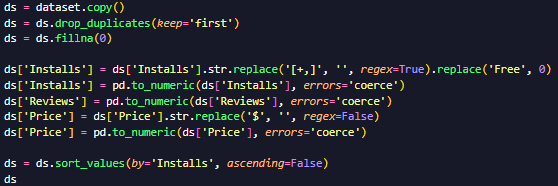
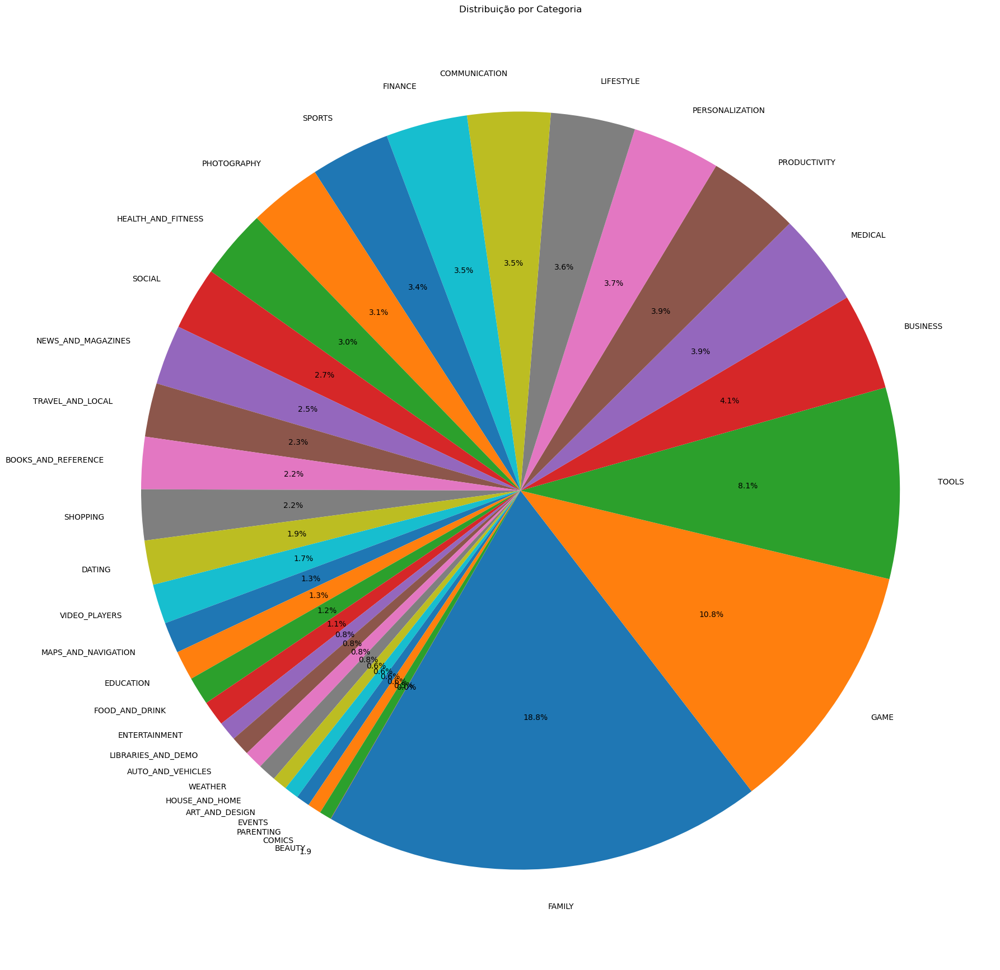

# Desafio
## Importando e normalizando dados
##### Importando bibliotecas e arquivo
Para iniciar o desafio, tive que instalar as bibliotecas Pandas e Matplotlib, além de executar o código no Python 3.12.7. Nesta parte, além de importar as bibliotecas também já aproveitei em criar o *dataset* que será usado para resolver o desafio.

##### Normalizando os dados
Optei em realizar a normalização dos dados do *dataset*, além de remover as linhas duplicadas, antes de começar a desenvolver o desafio, assim organizaria os dados e modificaria eles se necessário.

Certas escolhas que segui foi em criar uma cópia do *dataset* original para um novo e realizar a normalização nele, preencher os NaNs com 0 e trocar os "Free" por 0, tudo isso para melhorar na realização do desafio, e depois organizar o *dataset* pela coluna "Installs".

## Desenvolvendo o desafio
Terminando de normalizar os dados e começando a realizar o desafio, comecei seguindo a ordem de como está nos slides oferecidos do desafio.

Para mostrar os top 5 apps por instalação do *dataset*, primeiro criei um filtro onde já guarda os 5 apps mais instalados, depois foi só criar a tabela de barras com base no app e número de instalação dele.

Para realizar o gráfico de pizza com base na categorias, usei a mesma ideia do gráfico de barras, criar um filtro e fazer o gráfico com base nele. O único diferencial que este gráfico teve, foi ser criado em um tamanho grande para conseguir ver todas as categorias e suas porcentagem com relação ao gráfico.

Indo para a parte onde só tenho que informar os dados, sem gráfico, fiz eles da forma mais simplis como o app mais caro, app do conteudo "Mature 17+" (nesse só usei uma *condição* antes para fácilitar o filtro) e o top 10 app.
No top 10 app, decidi fazer ele diferente do anteriores, fiz a lógica para mostrar os 10 app com mais *reviews* e aproveitei de resetar o index para ter um novo e mostrar os 10 app de uma forma mais organizada.

##### Cálculos e gráficos extras
Na parte dos cálculos em que poderia escolher, optei em fazer __Apps com Rating >= 4.5, ordenados por número de reviews__ e __Soma total de instalações__. No apps com nota 4.5 ou mais, fiz da mesma forma do que top 10 app, e o de soma total, só realizei uma filtragem para "Installs" e fiz a soma de todos os valores dele com *sum()*.

Na parte dos gráficos em que poderia escolher, optei em criar gráficos que não se baseavam com o calculo do app com nota 4.5 e soma total, fiz dos __Top 10 apps por Installs__(em forma de linha) e __Rating por Preço__(em forma de dimensão), ambos sugeridos pelo slide do desafio .

