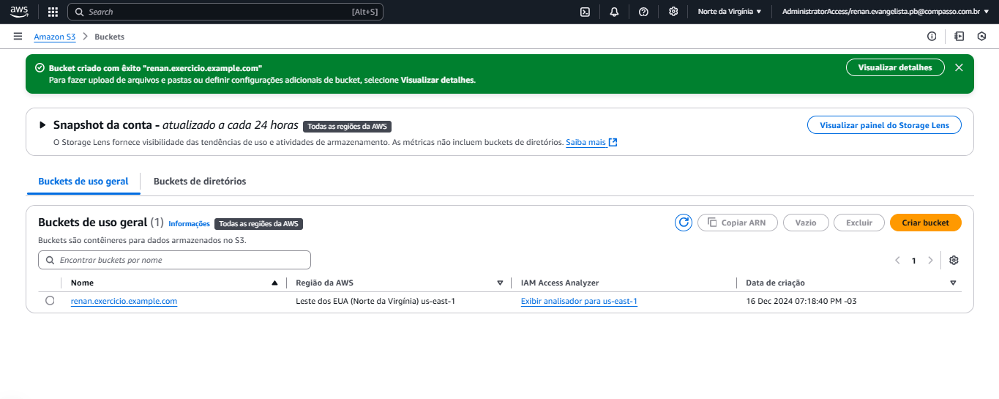
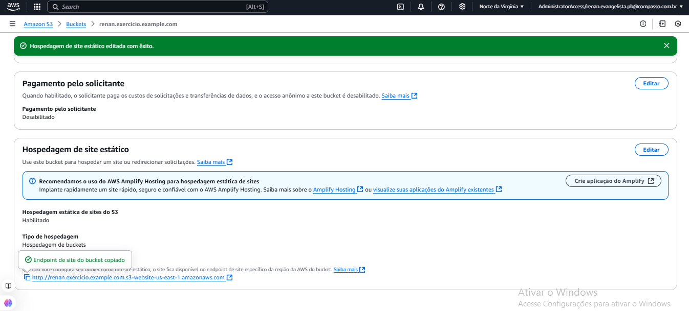
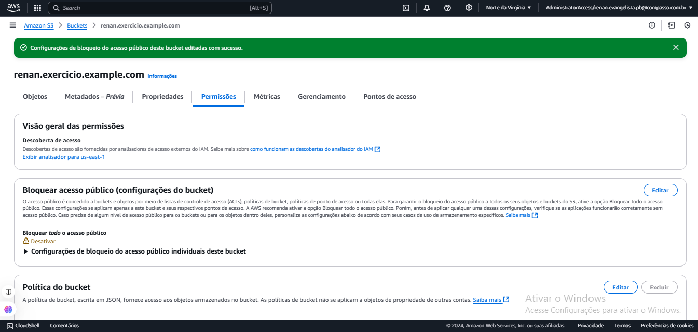
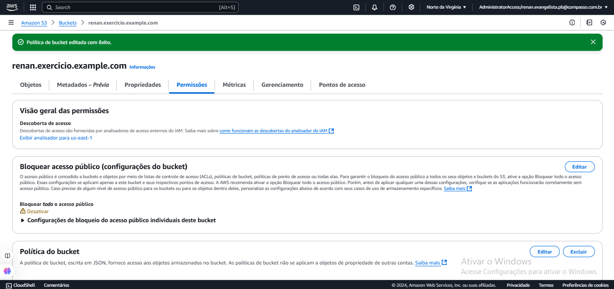
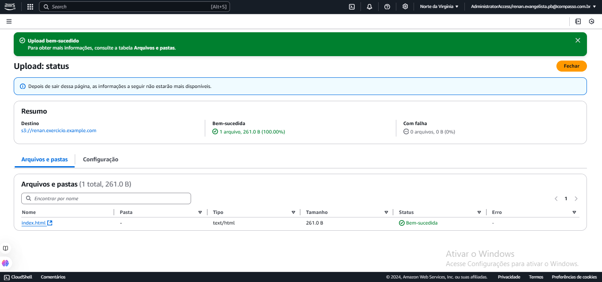
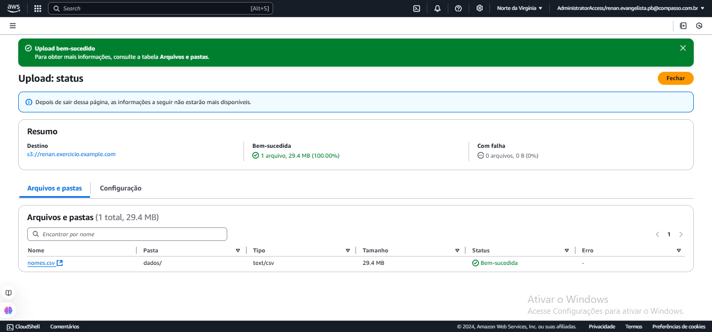
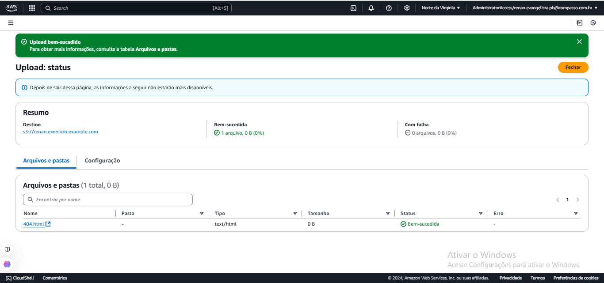
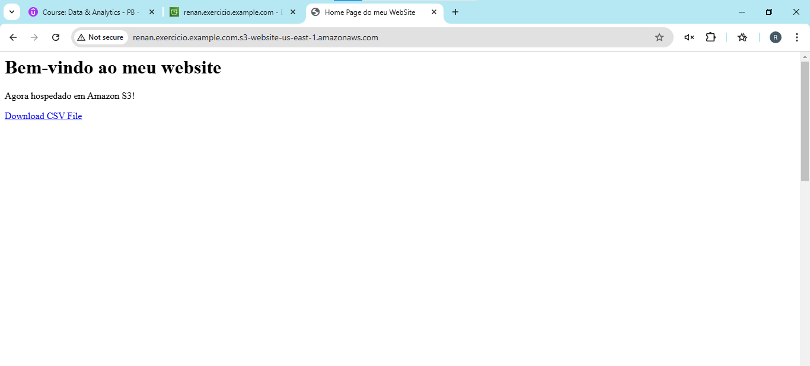

# Sprint 5
### Informações
Nessa sprint o foco foi em dar os primeiros passos no console da AWS. O primeiro passo para entender como é usar a AWS foi feito com o curso *Cloud quest*, um curso que informa passo a passo de como usar as funções existentes da AWS, tudo em forma de jogo. Depois desse curso, foi fornecido pela primeira vez um curso direcionado diretamente a prova CLF-02 da AWS, por meio da *AWS Cloud Practitioner*. E finalizando com um exercício, para testar nosso controle de uso do console da AWS por conta própria, e finalizando a sprint com a realização do desafio, que se baseava em rodar scripts, em python, que interagiam com a AWS.

No estudo do curso *Cloud quest* e o curso *AWS Cloud Practitioner* foi feito com foco e sem muitas dificuldade, na execusão do exercício não foi muito difícil graças a ótima explicação do curso da AWS, já no desenvolvimento do desafio, tive dificuldade mas todas elas foram solucionadas pelo monitor técnico Avner Dal Bosco, que orientou-me o máximo possível e que conseguiu me ajudar a terminar o desafio a tempo.
### Certificados
Nesta sprint além do curso proporcinado pela Udemy, também tive contato com o curso AWS *Cloud quest*, documentado por meio de um link para confirmação de conclusão de curso e uma *badge* e o curso  *AWS Cloud Practitioner*.

- [AWS Skill Builder - AWS Partner: Cloud Quest](./certificados/Aws_Cloud_Quest_Cloud_Practitioner.png)

https://www.credly.com/badges/fcd86be4-fd53-4056-927f-81fd318a97ac/public_url

- [AWS Skill Builder - AWS Partner: Cloud Practitioner](./certificados/AWS_Skill_Builder_Course_Completion_Certificate.pdf)

### Desafio
O desafio começou com a escolha de um conjunto de dados e a  instalação da biblioteca *boto3* para mandar dados para AWS pelos scripts em Python. O primeiro script foi configurado credenciais, criou um bucket na AWS e realizou o upload do arquivo CSV. No segundo script, foi feito o download do arquivo do bucket, seguido de sua normalização para resolver provlemas de encoding e ajustar as colunas. Após isso, os dados normalizados foram enviados de volta ao bucket, Na etapa de análise, o script utilizou o Pandas para manipular o CSV, transformando valores e implementando filtros e agregações para atender critérios específicos. A análise gerou novos dados que foram salvos em outro CSV e enviados novamente ao bucket, finalizando o desafio com sucesso.

- [Exercício Python](./desafio/)

### Evidências
O resultado que obitive realizando o desafio, sendo criando os sripts necessários e os resultados das ações dele. Tudo em forma de imagenm para ser usado no *readme* do diretório *desafio*.
### Exercícios
Nesta sprint a realização do exercício se baseou em criar um bucket na AWS e colocar os arquivos para hospedar o site estático, tudo sendo realizado pelo próprio console da AWS.

A execusão dele foi primeiro criar o bucket.

Depois foi habilitar a hospedagem do arquivo index e deixa-lo público.

Seguindo o passo a passo oferecido na orientações da sprint, fiz a política do bucket.

Chegando na parte de fazer upload dos arquivos do site, o *index.html*, pasta *dados* e o arquivo *404.html*.

Com a criação do bucket feita com sucesso, o upload dos arquivos do site feito com sucesso, tuda estava pronto e o site já estava funcionando como necessário.

Link do site hospedado:

http://renan.exercicio.example.com.s3-website-us-east-1.amazonaws.com

- [Exercício Python](./exercicios/)