# Desafio

Para começar o desafio, fui em busca de um conjunto de dados para servir como base do meu data frame do desafio, encontrando o conjunto de dados fui aprender a usar o *boto3* da biblioteca python, depois disso instalei ela e fui criar o 1° script do desafio.

Antes de ir para o primeiro script, é bom mostrar que não tinha nenhum bucket do desafio já feito. E isso é apresentado indo para o console da AWS.

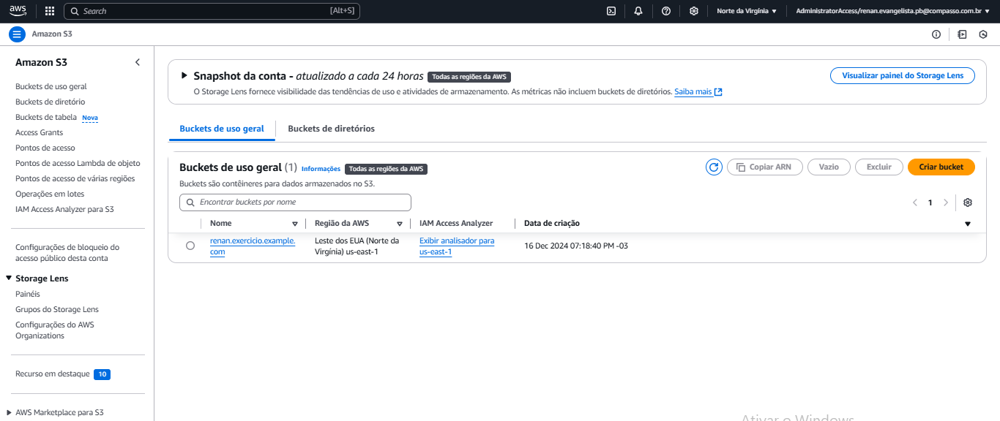

#### 1° Script Python

Nesse sript python, começei com a importação da biblioteca *boto3* e configurar as minhas credenciais localmente no script, colocando a o id da chave, a chave secreta e o token, tudo pra certificar que conseguiria executar os comando do script corretamente.

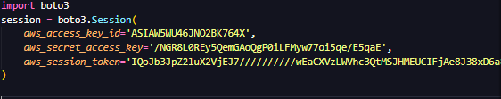

Feito a parte inicial do código, comecei a realizar a criação do bucket, usando a biblioteca *boto3*. Com o bucket criado, fui fazer o upload do conjunto de dados, com nome *"dados_abertos_contratos_vigentes_na_acmd_jun_2024.CSV"*, que escolhi para realizar o desafio. 

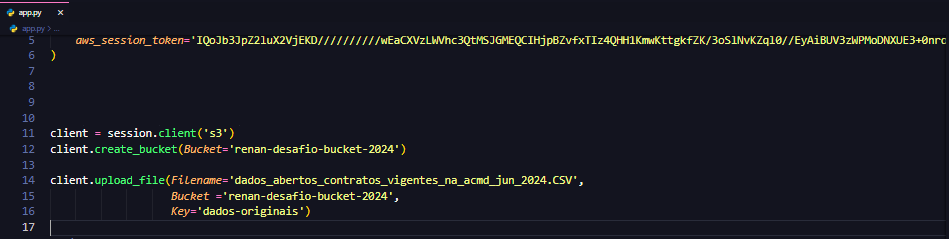

Uma prova que consegui criar o bucket é com o código que mostra no terminal os buckets que tenho, ou também é indo no console da AWS e vendo o bucket criado e com upload feito

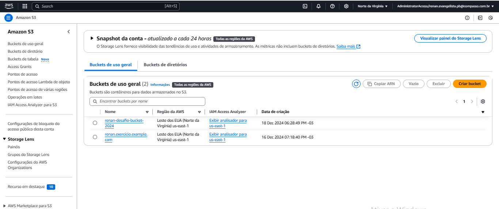

Com isso feito, já tinha terminado o primeiro script.  

#### 2° Script Python
Começando o script 2, criei as credenciais de acesso a AWS, igual ao script 1, e já comecei a desenvolver o script. Sendo a primeira tarefa a ser feita seria a de baixar o conjunto de dados que tinha mandado para o bucket, a forma como fiz isso foi usando a ferramenta de download da biblioteca *boto3*, e já nomeando ele para *"contratos_vigentes_na_acmd.CSV"*.

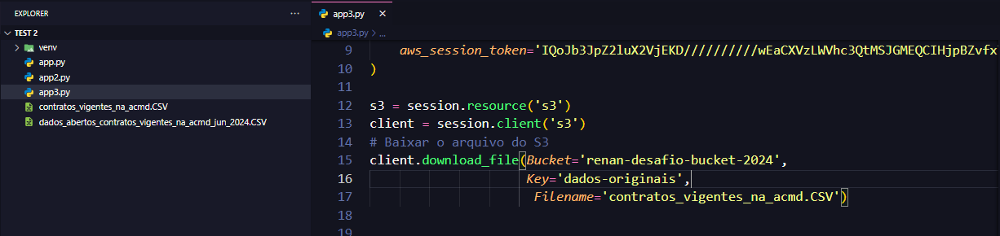

Feito isso, chegou a primeira parte complexa do script, a normalização, onde tive muita dificuldade de realizar, já que o principal problema era que os dados dentro do conjunto de dados eram com caracteres especiais, e quando abria o arquivo csv dava erro de leitura neles. 

A solução que tive foi fazer ela separando 2 vezes, uma em que padronizava ela no *encoding utl-8*, essa sendo feita abrindo o arquivo csv original, transformando ele em txt, salvando ele em txt, e depois tranformando o arquivo txt em csv de novo. Já que quando abria o arquivo csv no bloco de notas ele normal, principalmente os caracteres, e no csv original não.

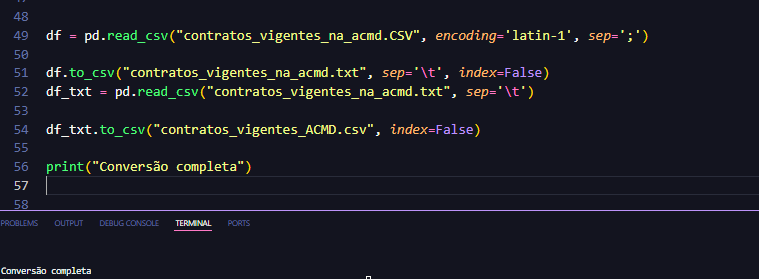

Feito essa primeira parte da normalização, fui arrumar um erro técnico no meu conjunto de dados, que se baseia que a primeira linha do conjunto ser um título dele, e só na segunda linha estar o nome das colunas. Então fui fazer a normalização dessa parte, que se baseou em abrir o csv novo, já normalizado pela primeira parte, e renomear o nome das colunas pelo o verdadeiro nome, nome esse que estava na segunda linha do conjunto, e depois apagando a segunda linha já que agora não era mais necessária.

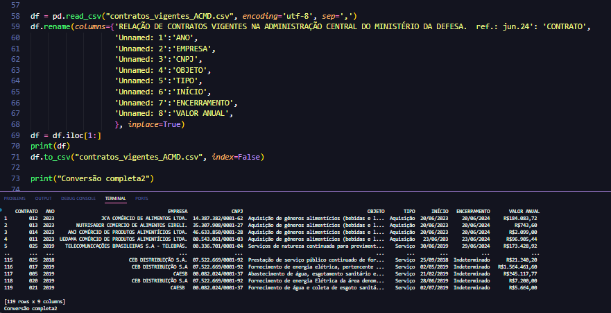

Com essa última parte da normalização, termina a normalização do conjunto de dados, agora podendo fazer upload dele para o bucket, constando os dados normalizados. Vendo aqui a parte do código para o upload e o resultado na AWS.

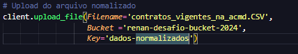

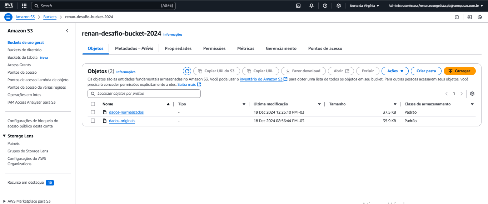

Feito o upload dos dados normalizado, mandando ele com o nome *dados-nomalisados*, começa a etapa de analisar os dados de acordo com os critérios.

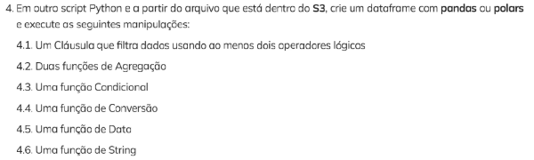

Começando a desenvolver este tópico 4, tive instalar o pandas e importar ele, feito isso já fui abrir o arquivo csv nomeado *"contratos_vigentes_ACMD.csv"* e realizar uma conversão de dados da coluna "Valor Anual" já que esse valor está na forma de string e apresentada como dinheiro, e precisava dela na forma só de número no tipo float. Feito isso comecei a realizar os sub-tópicos do tópico 4.

Na inicio, tópico 4.1, opitei em fazer a clasula de 2 operadores lógicos, com relação ao "Ano" dos contratos com o CNPJ iguais, este valor retornaria para uma series booleana que serviria como condição para uma cópia do data frame original, tudo isso sendo guardado em um novo data frame filtrado. Esse foi o primeiro sub-tópico e onde tive mais dificuldade de fazer, por causa de ter que relembrar como realizar um filtro no data frame e mostrar ele, os sub-tópicos seguintes não tiveram muita dúvida, até que quando comecei a lembrar como se usava o pandas comecei a realizar funções mais elaboradas e atingindo a espectativa desejada.

No sub-tópico 4.2, já comecei a realizar estruturas mais elaboradas, sendo um exemplo disso a primeira função de agregação, onde eu fazia uma series do tipo int, que se baseava em agrupar todos os contratos de 2023 em um só local, e depois mostrar quantos deles tinha nesse ano e quantos não tinha nesse ano, ainda na forma series tipo int.

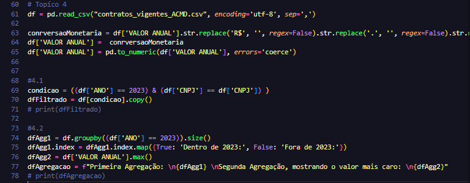

Do sub-tópico 4.3 até o 4.5 as resoluções dos critérios de cada sub-tópico foi apresentado como nova coluna no data frame, isso mostrando que poderia ter outra forma de apresentar os resultado e possibilaria de criar um novo arquivo csv, agora com os dados analisados.

E o sub-tópico 4.6 foi uma simples função de String tranformando o texto das colunas em minúsculas. Com isso finalizando a análise de dados do meu conjuntos de dados, agora colocando o nome *"contratos_vigentes_ACMD_analisados.csv"*, mostrando resoluções de todos os tipos, sendo complexos na lógica e na execução ou simplesmentes simples em lógica e execução.

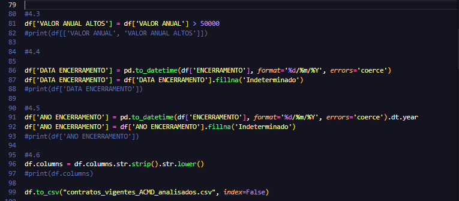

Termando a normalização e a análise dos dados, poderia fazer o upload dele para o bucket e finalizando o script, nomeando ele no bucket como *dados-analisados*.

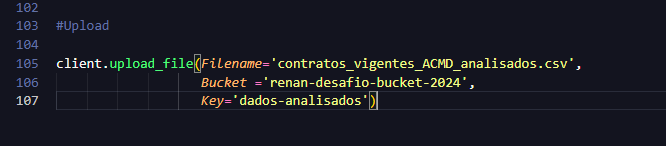

Assim finalizando o desafio da sprint 5.