# Sprint 5
### Informações
Nessa sprint o foco foi continuar a usar o console da AWS, e se preparar para o desafio final, do programa de bolsas. A sprint começou com cursos da AWS que informava como era a análise na AWS, e depois seguido por cursos que mostran o início de funcionamento de certos serviços da AWS, como Athena, Glue, EMR, Redshift e QuickSight. Todos cursos que contam um pouco como eles funciam e como usar, tudo apresentado de uma forma de fácil entendimento e sem muita dúvida. 

Além dos cursos da AWS, a sprint teve seu primeiro contato com o desafio final do programa de bolsa, o ínico dele se baseou em mostrar como é o desafio final, *Desafio Filmes e Séries*, e que ele é separado por 5 entregas, sendo a primeira dela nessa sprint, e entregar as perguntas que serão respondidas com os dados.
### Certificados

Nesta sprint só foi feito cursos da AWS baseados em serviços de Data & Analytics. Com o objetivo de ensinar como é a realização do processamento de uma grande quantidade de dados, sendo orientado por certos serviços da AWS.

- [AWS Skill Builder Amazon EMR Getting Started](./certificados/AWS_Skill_Builder_Amazon_EMR_Getting_Started.pdf)

- [AWS Skill Builder Amazon QuickSight](./certificados/AWS_Skill_Builder_Amazon_QuickSight.pdf)

- [AWS Skill Builder Getting Started with Amazon Redshift](./certificados/AWS_Skill_Builder_Getting_Started_with_Amazon_Redshift.pdf)

- [AWS_Skill_Builder_Glue_Getting_Started](./certificados/AWS_Skill_Builder_Glue_Getting_Started.pdf)

- [AWS Skill Builder Introduction to Amazon Athena (Portuguese)](./certificados/AWS_Skill_Builder_Introduction_to_Amazon_Athena_(Portuguese).pdf)

- [AWS Skill Builder Noções básicas de Analytics na AWS – Parte 1 (Português)](./certificados/AWS_Skill_Builder_Noções_básicas_de_Analytics_na_AWS–Parte_1_(Português).pdf)

- [AWS Skill Builder Noções básicas de Analytics na AWS – Parte 2 (Português)](./certificados/AWS_Skill_Builder_Noções_básicas_de_Analytics_na_AWS–Parte_2_(Português).pdf)

- [AWS Skill Builder Serverless Analytics (Portuguese)](./certificados/AWS_Skill_Builder_Serverless_Analytics_(Portuguese).pdf)

### Desafio
O desafio dessa sprint se baseia na primeira entrega do *Desafio "Filmes e Séries"*, um desafio que consiste na construção de um Data Lake com etapas de ingestão, armazenamento, processamento e consumo de dados. Antes de iniciar a primeira entrega, foi necessário explorar os arquivos CSV de filmes e séries para criar análises baseadas em perguntas que poderiam evoluir conforme o aprendizado. 

A primeira entrega envolveu criar um bucket na AWS S3, ler os arquivos CSV sem filtragem e realizar o upload para diretórios específicos no bucket, utilizando um arquivo Pythin integrado com *boto3* e executado localmente via Docker. O processo incluiu a criação do código Python para leitura e upload dos arquivos, a configuração do Dockerfile para executar o scipt, e a construção da imagem Docker com o parâmetro *-t* para nome e tag. O container foi rodado com *--rm* para exclusão automátiva após a execução, e volumes foram montados para acesso aos dados. Após verificar no console AWS S3, confirmou-se que os arquivos CSV estavam nos diretórios corretos, concluindo com sucesso a primeira entrega do desafio.

- [Desafio](./desafio/)

### Evidências
O resultado que obitive realizando o desafio, sendo criando os sripts necessários e os resultados das ações dele. Tudo em forma de imagenm para ser usado no *readme* do diretório *desafio*.
### Exercícios
Nesta sprint os exercícios se dividirão em 3, todos sendo da AWS, só que com serviços diferentes. O primeiro exercício é usando o serviço S3, o segundo Athena e o terceiro Lambda.

Na resolução dos exercícios começou com desconsiderar o que envolvia o serviço S3, já que ele já foi realizado na sprint 5. Fazendo com que o próximo exercício a ser feito era com o serviço da AWS Athena, e na pasta de exercício sendo dividida em 2 sub-pastas.

##### AWS Athena

- [AWS Athena](./exercicios/AWSAthena/)

Esse exercício se baseia em criar um banco de dados, realizar consultas e depositar as queries no bucket S3, já feito na sprint 5.

Para começar a realizar o exercício, tive que criar uma pasta no bucket do exercício da sprint 5, chamado *queries*, que salvaria as queries usadas na AWS Athena.

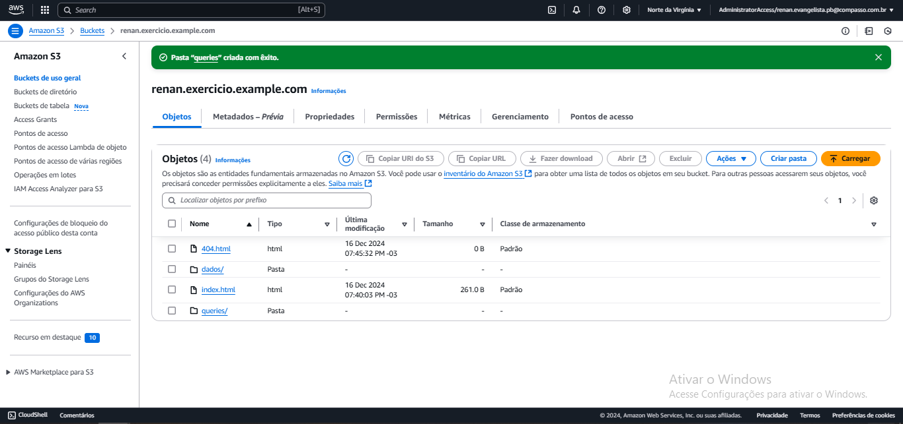

Feito esta pasta, pude ir para o serviço da AWS Athena, para configurar qual bucket receberia as queries que seriam usadas.

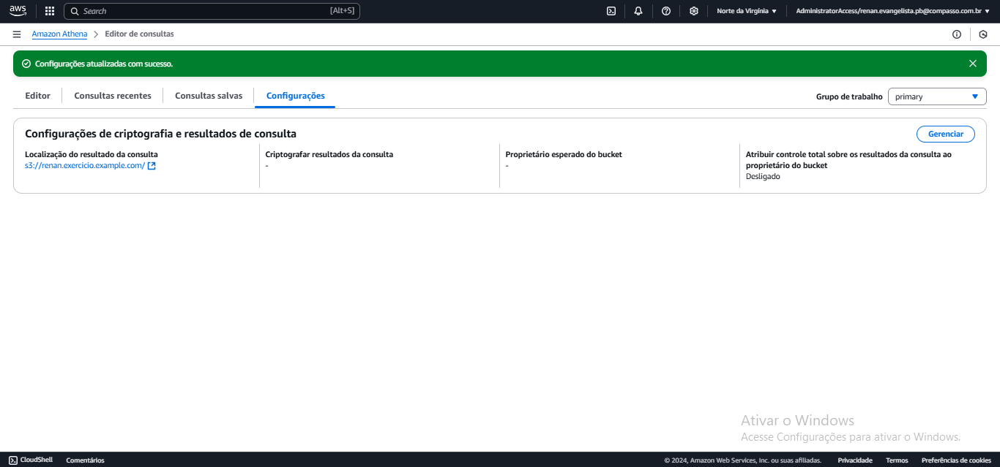

Depois de realizar todas as configurações necessárias, começei a criar o banco de dados na AWS Athena.

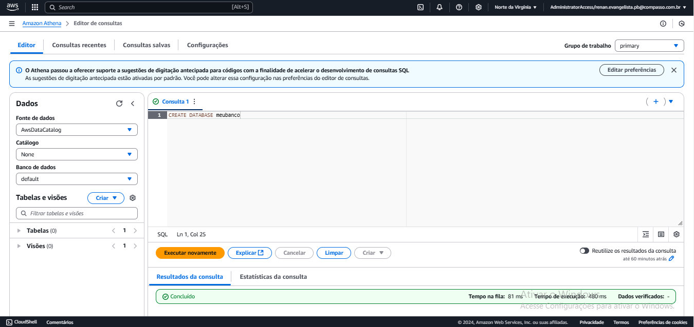

Seguindo para o próximo passo, seria criar a tabela com os atributos certos do arquivo csv, localizado no bucket, e já inserindo os dados dele na tabela do banco de dados. E aqui seria onde tive me primeira dificuldade na realização desse exercício, que foi o caminho para o bucket, que não ficou muito explicado nas orientações do exercício, mas vendo o materiam referente a essa parte consegui entender melhor e arrumar essa parte.

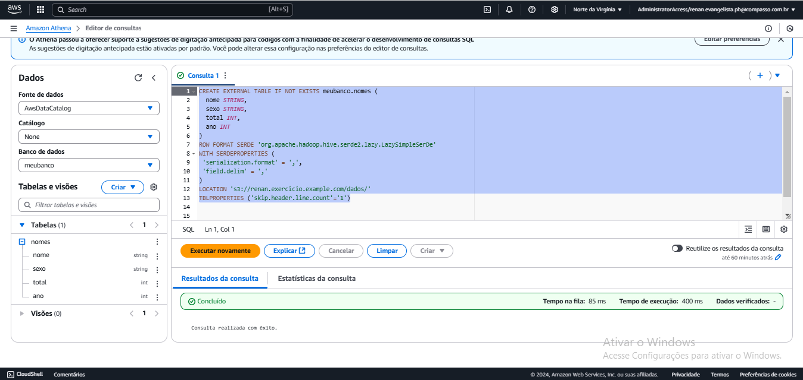

Próximo passo foi realizar o exemplo de consulta, para ver se tabela foi bem criada e os dados dentro dela estão correto. O que consegui realizar com exedo.

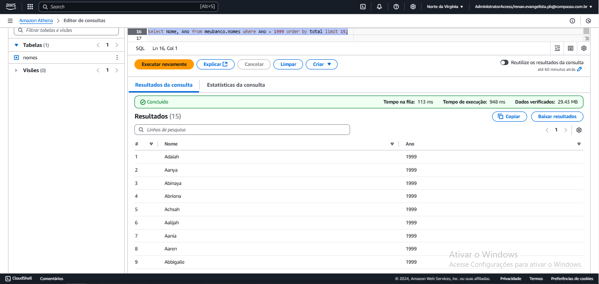

Agora é o exercício de consulta no banco de dados, que se baseia em mostrar os top 3 nomes de cada década do ano. Aqui foi onde encontrei a díficuldade de realizar ele, justo porque estava tentando fazer ele sem usar uma sub-consulta. Porém, quando tentei resolver usando uma sub-consulta que entregaria os 3 nomes, o processo todo se tornou fácil e o exercício resolvido.

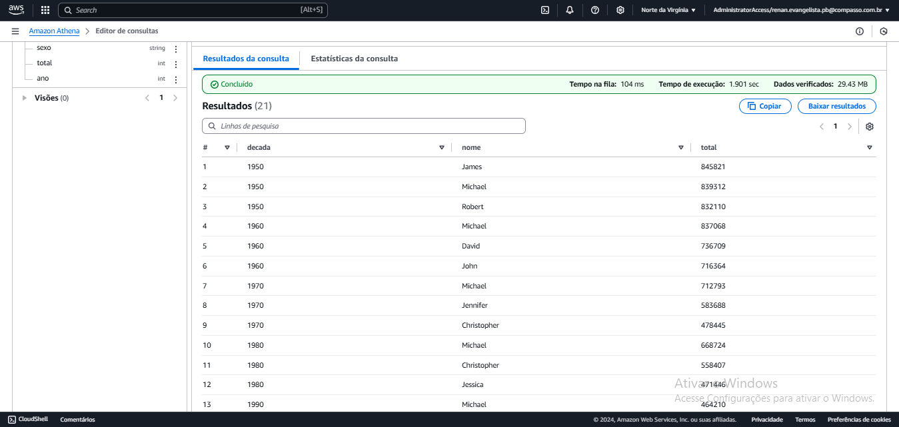

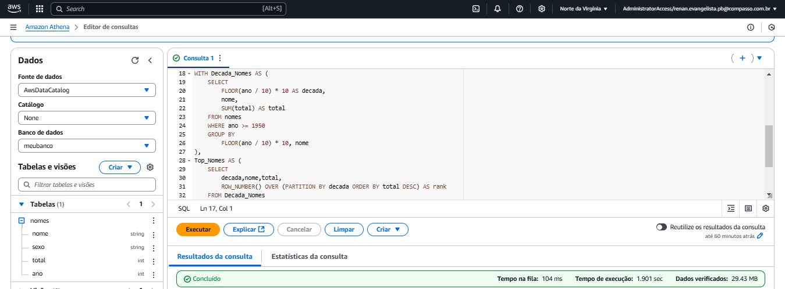

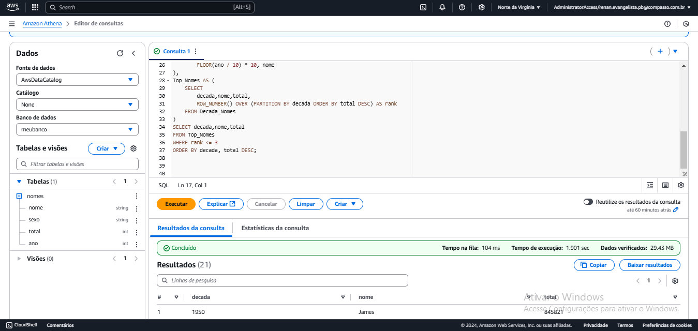

##### AWS Lambda

- [AWS Lambda](./exercicios/AWSLambda/)

Esse exercício se baseia em criar uma função na AWS Lambda e importar uma camada para funcionar a biblioteca *pandas*.

Para começar a realizar o exercício, fui para o console AWS Lambda, e criei a minha primeira função.

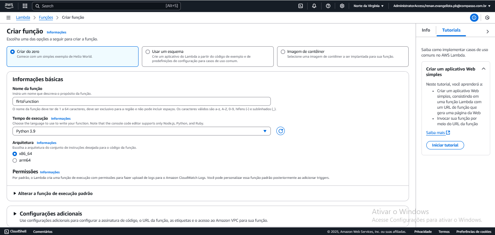

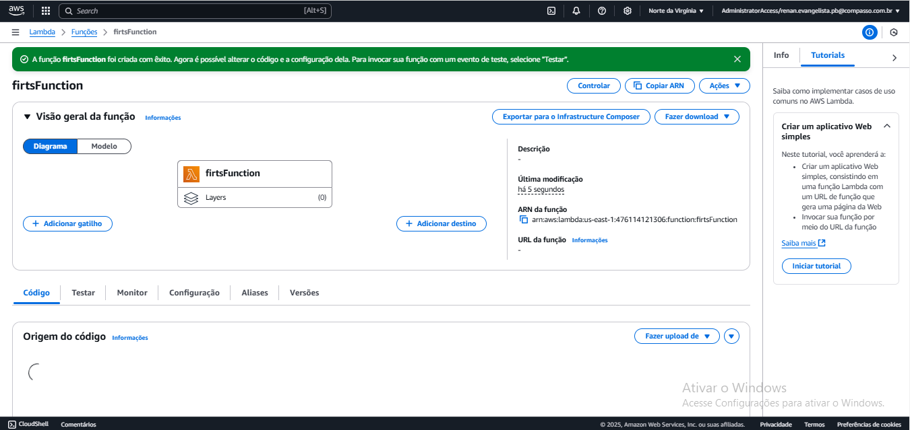

Com a função feita, foi a parte de ir criar o arquivo python dentro do próprio console AWS. Seguindo as orientações faladas nos slides do exercício, o arquivo python já estava feito, só precisava adicionar o nome do bucket ao qual guardava o arquivo csv que seria utilizado. Depois de colocar o arquivo python correto, tinha que criar um evento que mostraria o resultado da execução do arquivo python.

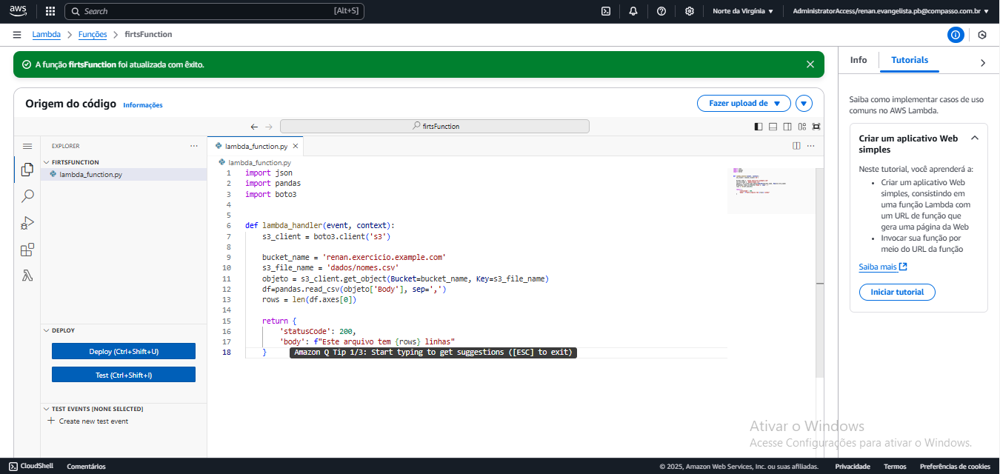

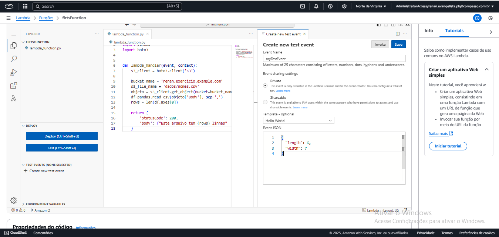

Feito tudo isso, rodei a função e aprensentou um erro, mas este erro já era de se esperar.

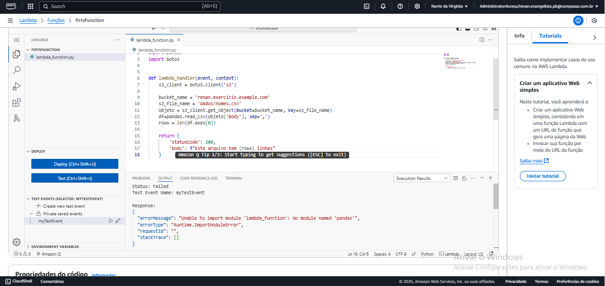

Para resolver esse erro, teria que importar uma camada na função Lambda que estaria a biblioteca pandas, a qual está sendo usado pelo arquivo python.

Indo para a criação dessa camada, ela seria feita localmente e apartir de um arquivo dockerfile. Com o arquivo dockerfile feito, rodei os comandos no terminal para que possa criar um ambiente linux que serviria para instalar a biblioteca.

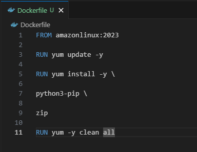

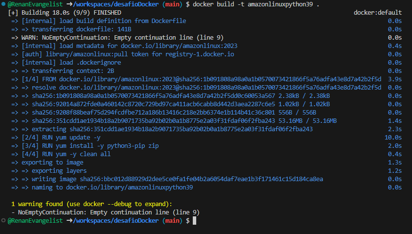

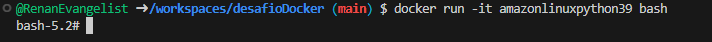

Feito todos os passos do docker, ele abriu um terminal linux que serviria para criação de um pasta que contia a biblioteca pandas, e todo o passo a passo para realizar essa parte, tinha nas orientações do exercício.

Esse passo seria, criar uma pasta, ir nessa pasta, instalar a biblioteca pandas, sair dela e zipar ela, e colocar ela na maquina de fora da que está sendo rodado no container e depois conseguir colocar no bucket da AWS S3.

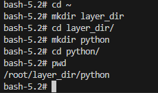

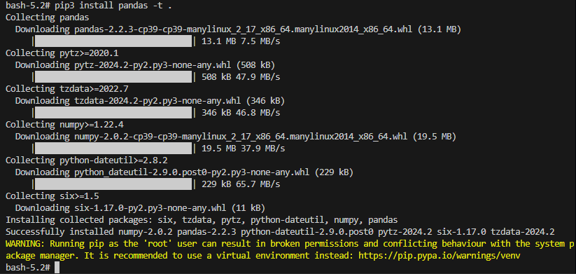

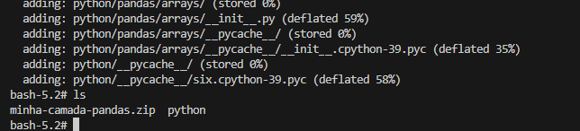

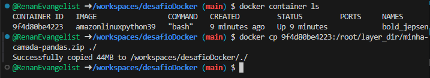

Terminando de zipar a pasta, só precisou mandar para a pasta *libs* dentro do bucket na AWS S3.

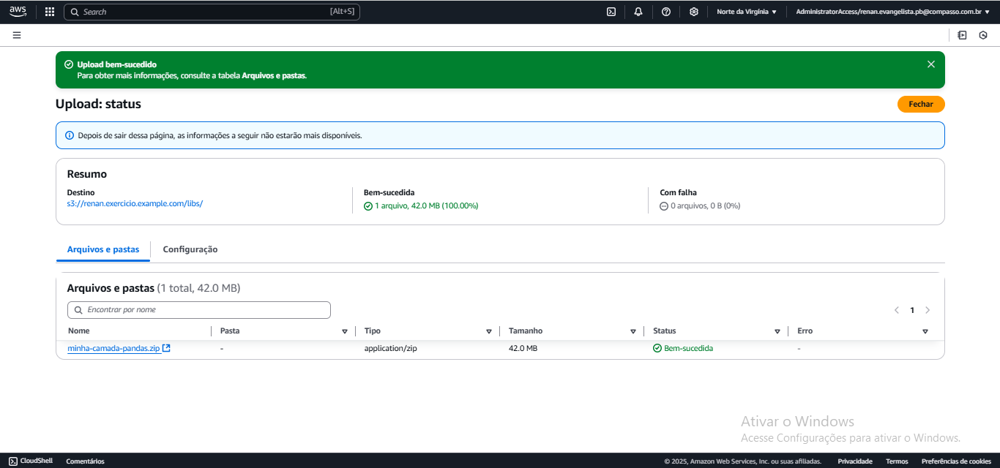

Feito isso, tinha que voltar para o AWS Lambda e crira uma camada, que ligaria com o arquivo zip do bucket.

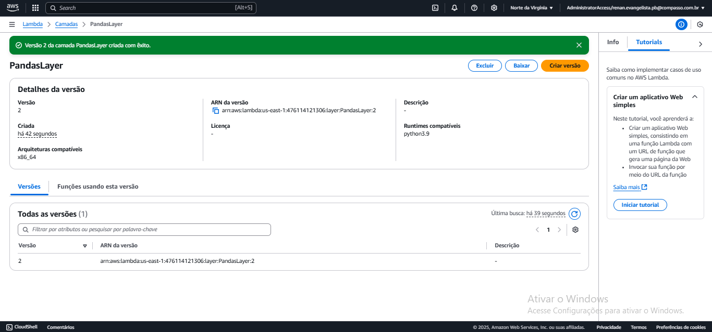

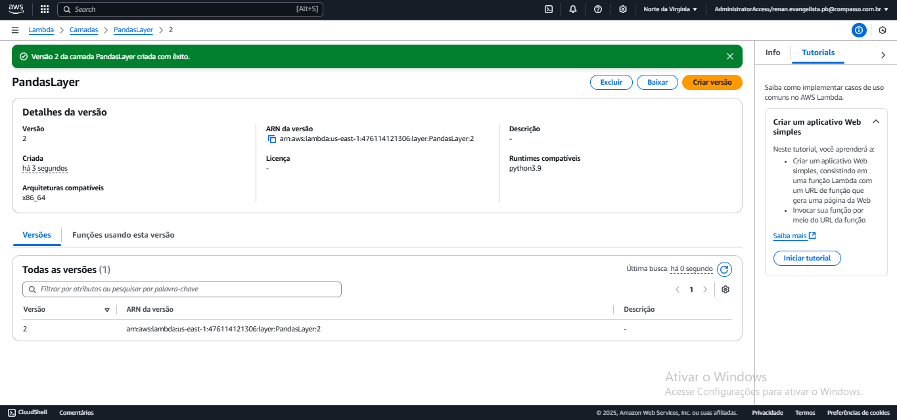

Feito a camada, voltei para a parte de funções e para a função que estava criando e adicionei a ela uma camada personalizada.

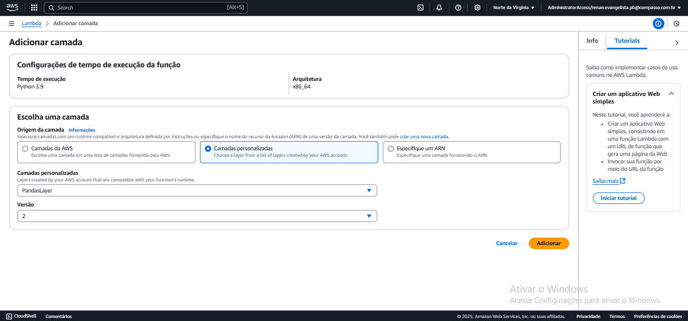

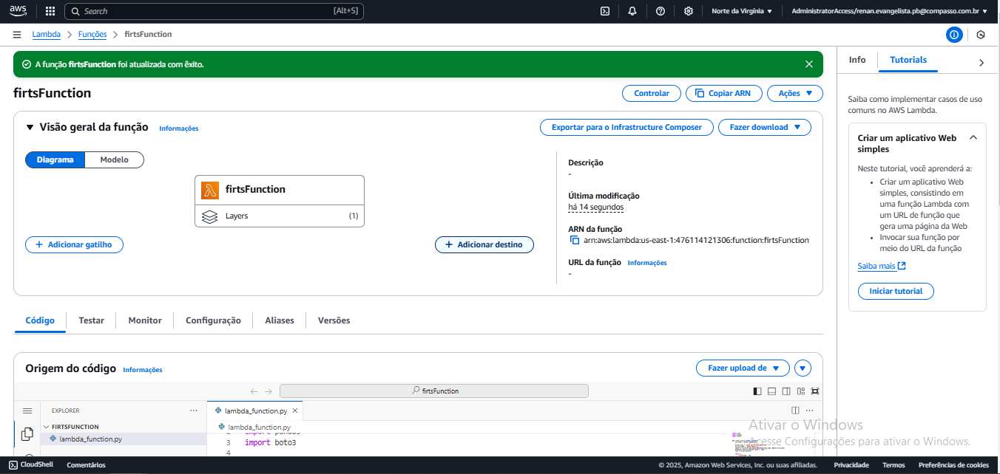

Com essa camada colocada, só faltou rodar a função de novo e mostrar o resultado já esperado pelo programa.

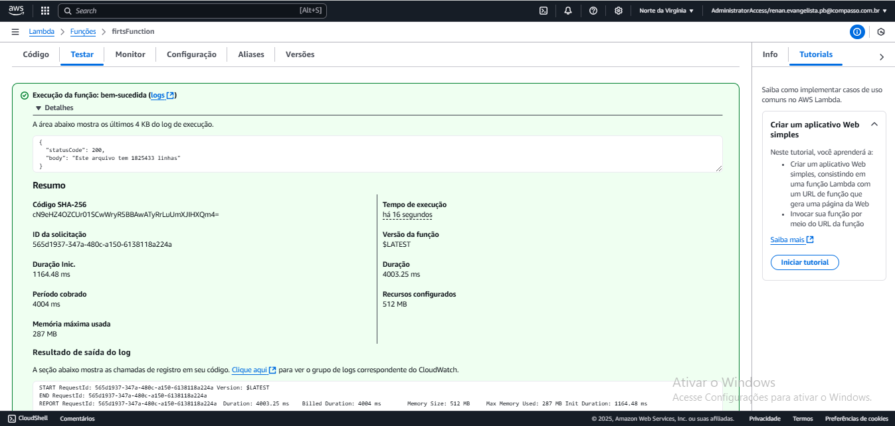

###### *Observação:*

Tive que alterar as configurações de funcionamento da função, porque a configuração padrão não estava conseguindo realizar a leitura do arquivo csv.

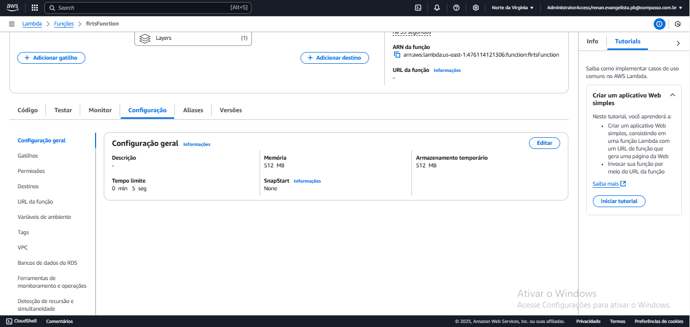
