# Desafio
Nesse desafio ele foi apresentado de uma forma diferente dos dos anteriores, já feitos, ele se baseia em um só desafio, mas que a cada sprint possa realizar uma entrega para chegar na conclusão do desafio como num todo.

O desafio final, ou *Desafio Filmes e Séries*, se baseia em construir um Data Lake, com as etapas de Ingestão, Armazenamento, Processamento e Consumo. 

### Questões para análise
Só que antes de começar a realizar o desafio, foi aprensentado um ponto importânte a se abordar, que se baseia em fazer o download dos arquivos csv, filmes e séries, e explorar o conteudo dele para criar uma análise usando os dados dele, definindo questões que os dados devem responder até a última entrega do desafio.

Aqui estão cetas questões que decidi fazer, sendo elas tanto fáceis quanto complexas de de realizar a análise, mas levando em consideração de que com as próximas sprints elas podem  se alterar dependendo do meu conhecimento.

__1° Pergunta__

Quantos filmes do Harrison Ford tem nota maior ou igual a 8?

__2° Pergunta__

Desses filmes, quais são os genêros que mais repetem?

__3° Pergunta__

Quantos filmes são de originade brasileira?

__4° Pergunta__

Qual é o filma mais bem visto de um diretor brasileiro?

__5° Pergunta__

Qual é o genêro deste filme?

__6° Pergunta__

Dos filmes mais bem avaliados, qual é o genêro que mais se repete?
### Primeira entrega

Depois de escolher as questões que usaria para análisar os dados dos conjuntos de dados, posso começar a fazer a primeira entrega do desafio final.

Essa primeira entrega se baseia em criar um bucket na AWS S3, a fazer a leitura dos arquivos csv, __sem__ filtar os dados, e fazer o upload deles para um diretório específico do bucket. Tudo isso por um arquivo dockerfile que vai acessar um arquivo python, usando a biblioteca *boto3*, e realizar a execusão dele localmente.

O primeiro passo para realizar essa parte é criar o arquivo python que será usado pelo dockerfile, ele se baseia em primeiro importar as bibliotecas de uso, as credenciais e realizar a leitura dos arquivos csv.

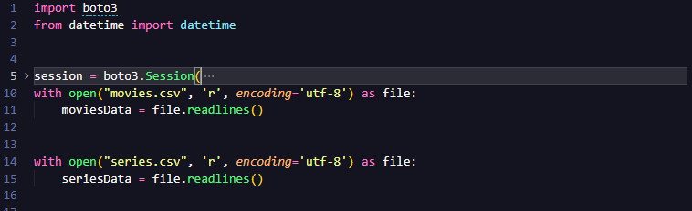

Depois de realizar a leitura deles, posso ir para a parte que define o caminho que os arquivos serão armazenar no bucket, em que foi me dado pelos slides de orientação do desafio.

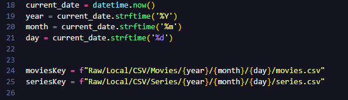

Agora só falta criar o bucket na AWS S3 e depois fazer o upload dos arquivos CSV, para os diretórios corretos nele.

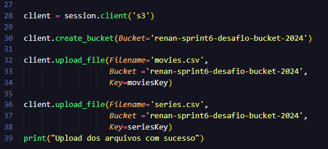

Terminado o arquivo python, era o momento de criar arquivo docker para que ele fosse executado e rodar o arquivo python. O arquivo docker foi feito simples e de uma forma em que possa criar volume e fazer upload dos arquivos csv.

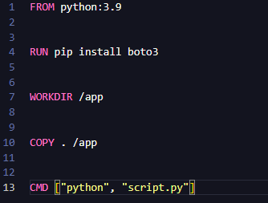

Feito todos os arquivos, era hora de ir para o terminal e criar a imagem do container. Para criar a imagem usei o parâmetro *-t* para colocar nome na imagem e já definir a tag da imagem com *latest*, que é feito por padrão. Depois de rodar, usei o comando *docker image ls* para ver se a imagem foi criada corretamente.

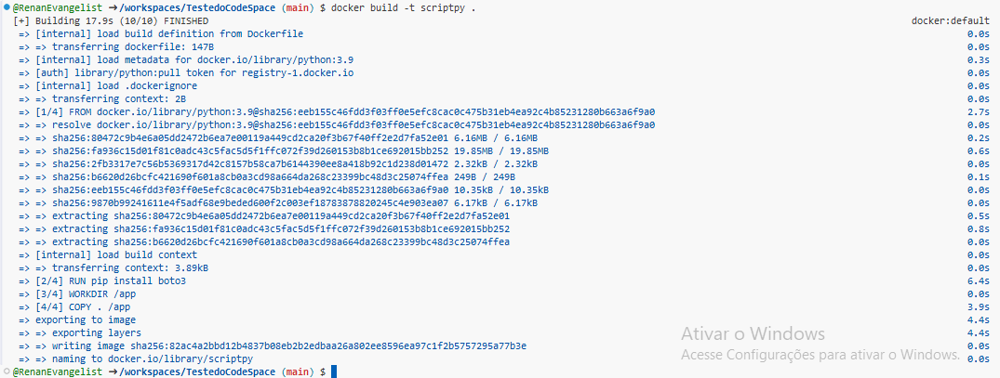

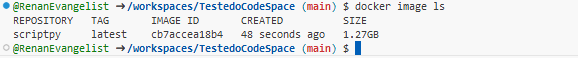

Com a imagem criada com sucesso, poderia criar e rodar o conteiner. No comando do para criar o conteiner decidi fazer ele diferente do normal, primeiro usei o parâmetro *--rm* para criar, rodar e deletar o container após o uso, pois ele não seria mais usado e não tinha necessidade de usar ele de novo, depois criei volume com o parâmetro *-v* e o caminho *"$(pwd)/data:app/data"* e para terminar tudo só faltou indicar a imagem que era *scriptpy*, com tudo isso feito, só foi rodar o comando e ele entregou a confirmação de execução e a de deletar-se no fim.

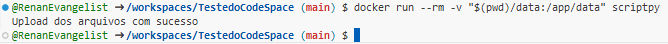

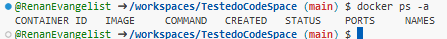

Agora que tudo rodou, era só ver no console AWS S3 se havia os arquicos csv no local certo.

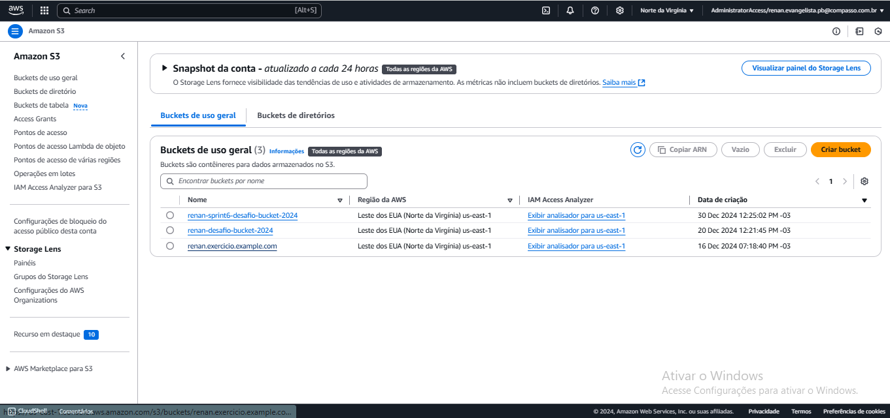

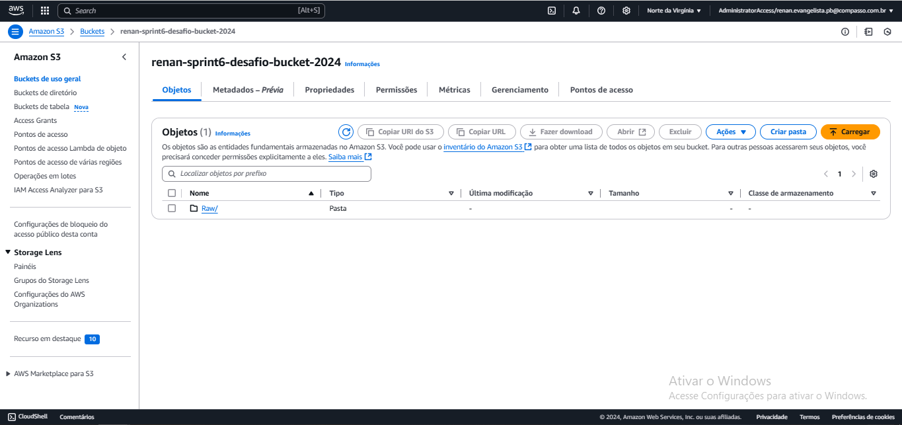

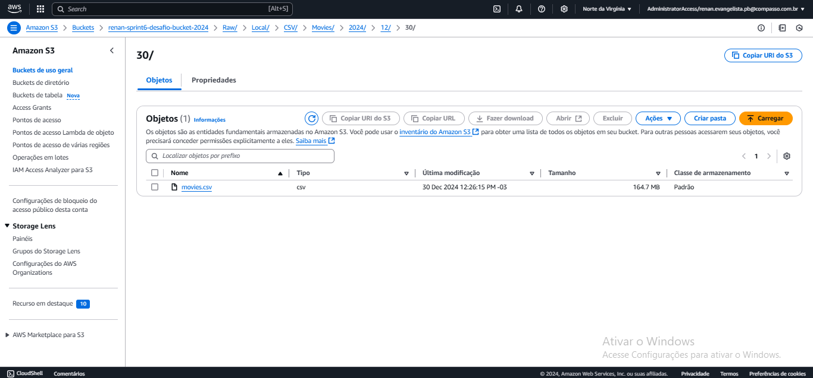

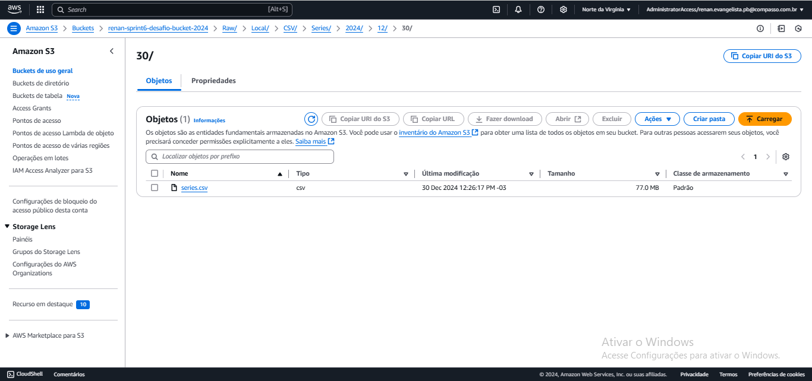

Com o fim da análise no console da AWS, pode se observar que tudo foi executado com sucesso e encessando a primeira entrega do desafio final.