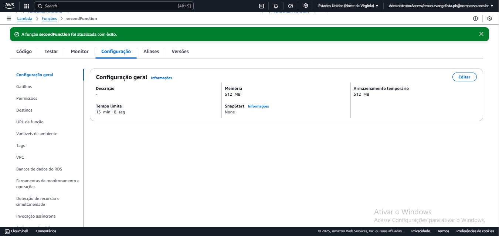

# Desafio
O desafio dessa sprint é uma continuação do desafio da spint 6, em que ambos fazem parte do desafio final ou *Desafio Filmes e Séries*, que se baseia em construir um Data Lake, com as etapas de Ingestão, Armazenamento, Processamento e Consumo.

### Questões para análise
Na minha segunda análise dos arquivos CSV, e agora a API The Movie DataBase, decidi fundamentar um tema com base na categoria que fui orientado a seguir, que era __comédia e animação__. Nessa segunda análise, desenvolvi um tema central baseado nas séries brasileiras, considerando tanto as do passado quanto as do presente. Isso me permitiu abordar as categorias corretas, elaborar um tema e formular perguntas relacionadas a ele.

O tema que escolhi foi:
__A trajetória das animações e comédias brasileiras: dos maiores sucessos às novas gerações de séries e dubladores.__

__1ª Pergunta__
Quais são as melhores comédias brasileiras lançadas entre 1980 até 2000?

__2ª Pergunta__
Quais dessas séries ainda fazem sucesso?

__3ª Pergunta__
Quantas delas tiveram novos derivados ao longo do tempo?

__4ª Pergunta__
Quais são os dubladores mais famosos do Brasil que atuaram em séries animadas?

__5ª Pergunta__
Entre esses dubladores, quais são os mais jovens na carreira?

__6ª Pergunta__
Quais são as melhores animações brasileiras lançadas entre 2001 a atuais?

__7ª Pergunta__
Quais dessas séries ainda continuam fazendo sucesso?

### Segunda entrega

Nessa Segunda entega do *Desafio Filmes e Séries* ela foi focada pela API The Movie DataBase, uma API que se liga a um banco de dados com todos os filmes e séries já feitos, com todas as suas características entregues, só basta ter um bom filtro na url que está pesguisando.

Além do foco na aprendizagem da API TMDB, seria necessário realizar um programa que usaria essa API, e entregaria o conteudo que a API retornaria e colocala em um arquivo JSON. Esse processo é para ser feito na AWS Lambda e os arquivos que deveram ser criados nesse serviço, vão ser armazenados no bucket *renan-desafio-filmes-series-2024* da AWS S3.

Indo para o passo a passo de como realizei o desafio, começa com a necessidade de criar uma layer contendo a biblioteca da Tmdb, que seria usado na AWS Lambda. A forma que escolhi para fazer essa layer foi criar as pastas e instalar a biblioteca dentro de uma dessas pastas e depois zipar ela, sem usar o docker para rodar tudo isso em um container.

- [Lambda Function Animação](./lambda_function_animacao.py)

- [Lambda Function Comédia](./lambda_function_comedia.py)

Depois de criar a pasta compactada, só foi preciso colocar ela no bucket, de forma manual,guardar o caminho do arquivo no bucket, depois ir para a AWS Lambda criar a função que rodaria o arquivo python do desafio.

Depois de criar a função Lambda,*secondFunction*, tinha que criar a camada que constaria o arquivo zip que estaria no bucket. 

Com ela criada só era necessário importar na função.

Antes de rodar a função Lambda, teria que arrumar a configuração dela para que conseguisse executar sem dar erro de *TimeOut*.

Nessa parte do desafio, decidi fazer ele de diferente, com 2 arquivos python, um que usaria os dados do arquivo CSV e completraria as informações com a API, e outro que teria a mesma informação que está no CSV, só que com mais séries que atinge até a atualidade.

Nesse código é feito com base no arquivo CSV e completa as informações dele com a da API. Ele começa puxando a informação do arquivo CSV no bucket do desafio e depois complementa com novas informações vinda da API, logo depois, quando vai separar as informações coletada para o registro, ele já separa por meio do genêro comédia e no periodo 1980 até 2000, já que esses dados estáriam no arquivo CSV e não precisaria trazer da API.

Nesse código é feito usando a API do TMDB, por ter dados que vem até os dias atuais, para trazer os dados, mas com o genêro de comédia e com data de estreia apartir de 2001 até atuais. Indo para o código, ele foi feito em 2 funções.

Na primeira função do código no Lambda, ele é feito em: Guardar a chave da API, URL básica, e URL's extras que iriram pegar informações que serviriam como complemento da URL básica, e criar o arquivo JSON com os 100 registros organizados.

Indo para os pontos importântes dessa primeira função é, a URL básica, que tinha que condizer com o tema da minha análise,que se baseava em séries e dubladores brasileiras, a melhor forma que consegui pensar em fazer isso foi primeiro fazer a url mesmo, depois colocar a minha chave API, junto já separando por lingua português brasileiro e ordenar pela populariedade de forma descrecente, do maior para o menor, depois é separar pelo país e a categoria animação, e no período que segue a análise,2001 até atuais.

Segundo ponto a ser apontado é as outras 2 URL's que criei no código, elas foram criadas pra fortalecer a url básica, já que fui orientado que nas próximas sprint poderia mudar a minha análise, e decidi trazer o máximo de informação que conseguia da API para não precisar refazer ela em busca de mais informação, e o ID do __IMDB__, que vai ser útil para próxima sprint.

Terceiro ponto, foi a criação do arquivo JSON, ele teria que ter no máximo 100 registros, então teria que navegar em mais de 1 página da URL, por isso coloquei o *loop for*, depois for fazer ele depois de usar as url's, e foi aqui onde mais tive dúvida por ter que mudar com relação a *extra_url*, por ser uma url que traria conteúdo que não faz parte da minha análise agora, mas que nas próximas sprints fará parte.

Com o termino da primeira função do código, a segunda foi só baseada em mandar o arquivo JSON para o bucket com os diretórios certos.

A única dificuldade nessa função, é que não conseguia mandar o arquivo JSON para o bucket, mas foi resolvido com uma lógica usada em sprint anterior. A lógica que me foi usada como base, se baseia em ler um arquivo csv, escrever ele em txt e depois transformar esse arquivo txt em csv de novo, a única diferença que tive foi 

Depois de fazer o código, só foi necessário arrumar a politic do IAM do Lambda para conseguir fazer o upload no bucket.

E pronto, o código rodou com sucesso e com isso foi capaz de criar as pastas e os aquivos JSON's no bucket com sucesso.

Resultado de como ficou a organização dentro dos arquivos JSON's.

