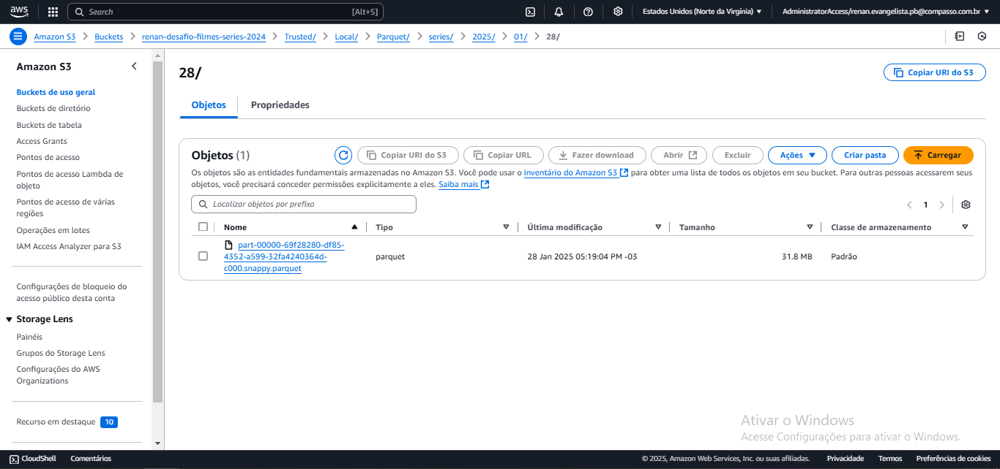
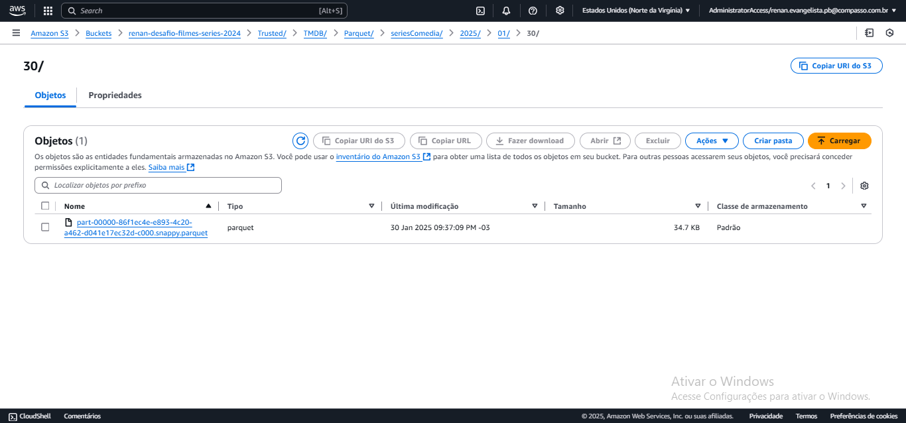

# Desafio
O desafio dessa sprint é uma continuação do desafio da spint 6, em que ambos fazem parte do desafio final ou *Desafio Filmes e Séries*, que se baseia em construir um Data Lake, com as etapas de Ingestão, Armazenamento, Processamento e Consumo.

### Questões para análise
Na minha segunda análise dos arquivos CSV, e agora a API The Movie DataBase, decidi fundamentar um tema com base na categoria que fui orientado a seguir, que era __comédia e animação__. Nessa segunda análise, desenvolvi um tema central baseado nas séries brasileiras, considerando tanto as do passado quanto as do presente. Isso me permitiu abordar as categorias corretas, elaborar um tema e formular perguntas relacionadas a ele.

O tema que escolhi foi:
__A trajetória das animações e comédias brasileiras: dos maiores sucessos às novas gerações de séries e dubladores.__

__1ª Pergunta__
Quais são as melhores comédias brasileiras lançadas entre 1980 até 2000?

__2ª Pergunta__
Quais dessas séries ainda fazem sucesso?

__3ª Pergunta__
Quantas delas tiveram novos derivados ao longo do tempo?

__4ª Pergunta__
Quais são os dubladores mais famosos do Brasil que atuaram em séries animadas?

__5ª Pergunta__
Entre esses dubladores, quais são os mais jovens na carreira?

__6ª Pergunta__
Quais são as melhores animações brasileiras lançadas entre 2001 a atuais?

__7ª Pergunta__
Quais dessas séries ainda continuam fazendo sucesso?

### Terceira entrega

Nessa terceira entrega do *Desafio Filmes e Séries*, ela foi focada na transformação dos arquivos que estão na pasta *Raw* do bucket, os arquivos CSV e JSON, para o formato PARQUET, isso tudo seria feito no AWS Glue, sendo armazenados numa nova pasta no bucket *renan-desafio-filmes-series-2024* chamada *Trusted*. Além de realizar o desafio no Glue, ele teria que ser feito usando o Apache Spark, e usar a AWS Athena para verificar os arquivos PARQUET.

A organização dos arquivos python para a execução do desafio está separado em pastas, CSV e JSON, e com seus arquivos pythons em cada uma delas.

- [AWS Glue para CSV](./CSV/jobCsv.py)

- [AWS Glue para JSON Comédia](./JSON/jobJsonComedia.py)

- [AWS Glue para JSON Animação](./JSON/jobJsonAnimacao.py)

Comecando a criar a terceira entrega do desafio final, ele começa criando um Job no Glue, com as configuranções usadas no antigo exercício Glue, feito em sprint anterior, além das configurações que as próprias orientações do desafio mandou.

Feito o job no Glue, e te-lo configurado, só precisei ver como estava o bucket antes de executar para pegar os caminhos que seriam usados como *S3_INPUT_PATH* no job.

Com todos os caminhos feito, só foi ir para o código. Indo para este primeiro código ele seria focado nos arquivos CSV's, o código python desse job ele teve sua dificuldade em ser feito na hora em como colocar a data no caminho de saida do arquivo parquet e tentar deixar ele em um único arquivo.

Nessa primeira vez rodando o código deu erro, e só arrumei depois de certos testes tentando ver onde era o erro, como a forma como guardar a data atual e juntar tudo em um único parquet, mas depois de arrumar esses problemas o job rodou certinho.

Uma prova de como o código rodou bem, só foi ver as pastas criadas no bucket *renan-desafio-filmes-series-2024*.

Com o primeiro arquivo CSV feito, só foi necessário alterar o caminho da saida do arquivo PARQUET do código no job e o caminho de entrada do arquivo csv, que está configurado com váriavel na própria configuração do Job do Glue, isso fez com que o segundo código python fosse praticamente idêntico ao primeiro, só que alterando esses dois caminhos.

E ainda, criando o diretório certo no bucket.

Com o fim do arquivo python para tratar os arquivos CSV, foi a hora de tratar os arquivos JSON's que tenho, o primeiro que escolhi foi o JSON de comédia, ele só precisaria arrumar a ordem de como estava o registros e transformar em PARQUET, então não tive muita dificuldade nesse primeiro arquivo python.

O caminho que escolhi para fazer esses JSON's foi em separar eles por cada série de gênero focada, pois a informações que consta neles são totalmente diferentes e que não se conversão entre elas, só com o arquivo CSV, então o diretório que ficou no fim dele foi *Trusted/TMDB/Parquet*, a especificação de dados foi *seriesComedia*, e a data de ingestão. Esse foi o único diferencia que realizei no caminho do arquivo.

Com o fim do primeiro código python para os arquivos JSON's, foi fazer o segundo código, esse segundo código tive uma dificuldade em tentar colocar uma ideia no meu registro, tentar preencher os IDs do IMDB que estavam nulos, para realizar isso tive ajuda do monitor dessa sprint, o que também já me ajudou com possível problema que teria com essa ideia na próxima sprint, mas tentando colocar a ideia em pratica, estudei mais o Spark e fui tirando dúvidas que gerava com o monitor, e no fim consegui realizar uma forma de fazer essa ideia funcionar e não alterar o resto das informações do registro. E depois só foi fazer o caminho de saída do arquivo PARQUET, com a especificação de dados sendo *seriesAnimacao*.

Terminando os arquivos python's no Glue, foi só criar o Crawler para ver como estária o registro dos arquivos PARQUET, seguindo as antigas orientações do arquivo pdf enviado no exercício de Glue em sprint passada, começando com o Crawler para ler os arquivos PARQUET's da pasta *Trusted/Local*, colocando nome, caminho até ele, iam e saida (que seria a tabela).

Com o Crawler feito só foi ir a tabela criada, e ir no AWS Athena para ver se o *SELECT* retornaria informação.

O sucesso do primeiro Crawler feito, só foi necessário fazer o que ia ler os arquivos que estão na pasta *Trusted/TMDB*, seguindo a mesma forma de criação do antigo Crawler.

E finalizando o desafio, só foi ver a tabela Crawler criado e ir na AWS Athena ver a consulta feita, que conseguiu retornar os registros do arquivo PARQUET.

