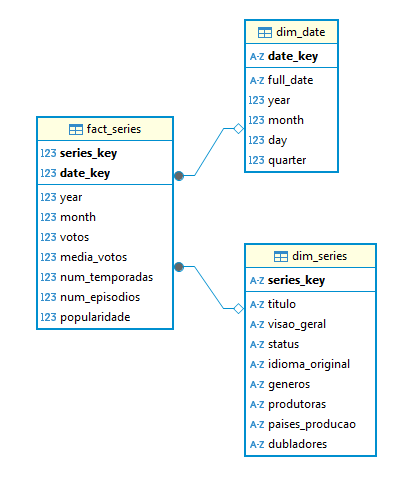

# Desafio
O desafio dessa sprint é uma continuação do desafio da spint 6, em que ambos fazem parte do desafio final ou *Desafio Filmes e Séries*, que se baseia em construir um Data Lake, com as etapas de Ingestão, Armazenamento, Processamento e Consumo.

### Questões para análise
Na minha segunda análise dos arquivos CSV, e agora a API The Movie DataBase, decidi fundamentar um tema com base na categoria que fui orientado a seguir, que era __comédia e animação__. Nessa segunda análise, desenvolvi um tema central baseado nas séries brasileiras, considerando tanto as do passado quanto as do presente. Isso me permitiu abordar as categorias corretas, elaborar um tema e formular perguntas relacionadas a ele.

O tema que escolhi foi:
__A trajetória das animações e comédias brasileiras: dos maiores sucessos às novas gerações de séries e dubladores.__

__1ª Pergunta__
Quais são as melhores comédias brasileiras lançadas entre 1980 até 2000?

__2ª Pergunta__
Quais dessas séries ainda fazem sucesso?

__3ª Pergunta__
Quantas delas tiveram novos derivados ao longo do tempo?

__4ª Pergunta__
Quais são os dubladores mais famosos do Brasil que atuaram em séries animadas?

__5ª Pergunta__
Entre esses dubladores, quais são os mais jovens na carreira?

__6ª Pergunta__
Quais são as melhores animações brasileiras lançadas entre 2001 a atuais?

__7ª Pergunta__
Quais dessas séries ainda continuam fazendo sucesso?

### Quarta entrega
Nessa quarta entrega do desafio filmes e séries ela foi dividida em 2 realizações, uma para realizar a modelagem de dados e outra para o processamento, e mandar tudo para a camada *Refined*.

##### Modelagem de dados Camada Refined
Nessa etapa tem que criar o modelo de como ficará sua modelagem multidimensional para servir como ferramenta de visualização (usando a AWS QuickSight na próxima Sprint). 

Para criar as tabelas por meio do AWS Glue, primeiro fui criar um esboço de como as tabelas e seus relacionamentos ficariam, para isso criei a modelagem dimencional no DBeaver.

Indo para o DBeaver, foi só criar um esboço de como ficaria minha organização de modelagem, para isso criei as tabelas lá para ver como ficaria a organização final. Comecei pela a dimensão data, *dim_date*, que guardaria as datas dos registros, e dividido em dia, mês, ano, trimestre (quarter) e data inteira, tudo isso vindo da . Depois de criar a dimensão de data, fui criar a dimensão séries, *dim_series*, que guardaria 

