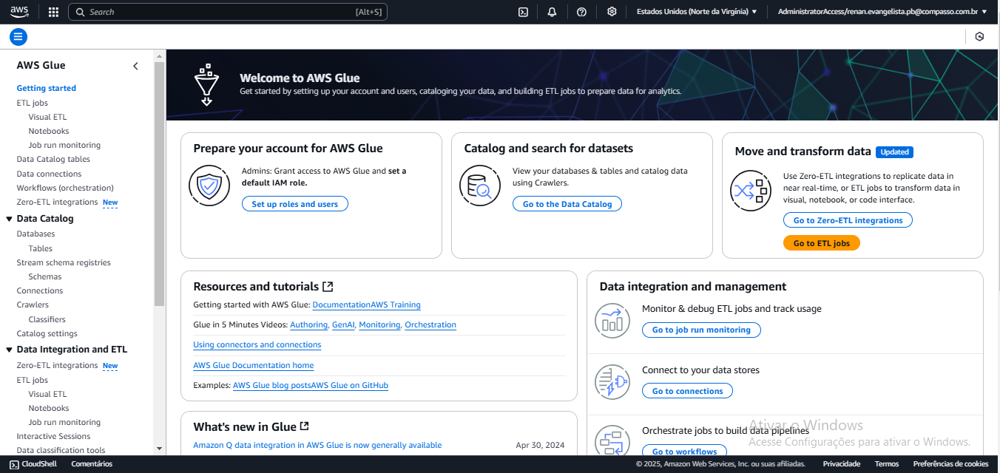
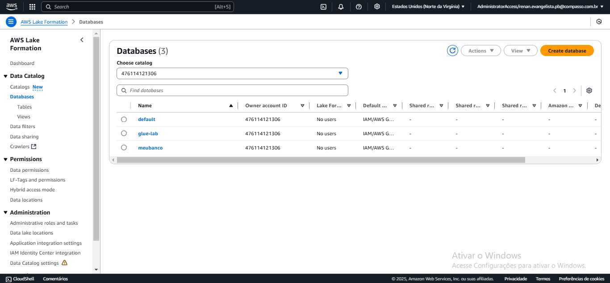
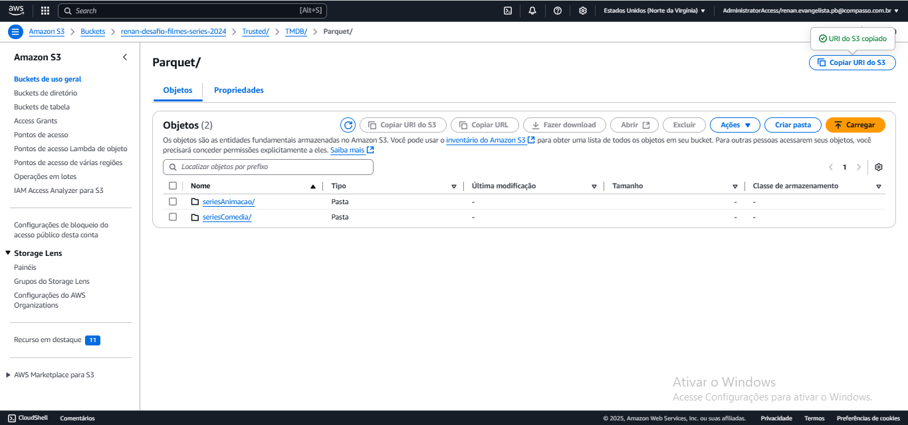
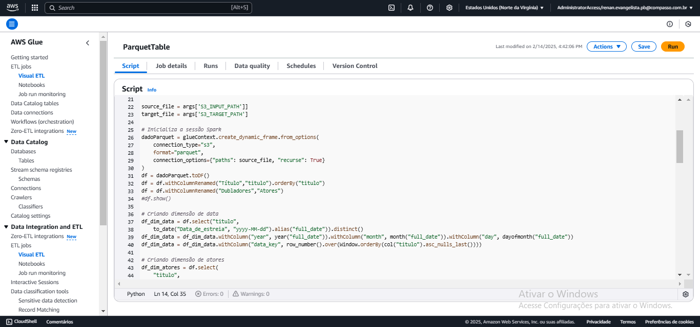

# Desafio
O desafio dessa sprint é uma continuação do desafio da spint 6, em que ambos fazem parte do desafio final ou *Desafio Filmes e Séries*, que se baseia em construir um Data Lake, com as etapas de Ingestão, Armazenamento, Processamento e Consumo.

### Questões para análise
Na minha segunda análise dos arquivos CSV, e agora a API The Movie DataBase, decidi fundamentar um tema com base na categoria que fui orientado a seguir, que era __comédia e animação__. Nessa segunda análise, desenvolvi um tema central baseado nas séries brasileiras, considerando tanto as do passado quanto as do presente. Isso me permitiu abordar as categorias corretas, elaborar um tema e formular perguntas relacionadas a ele.

O tema que escolhi foi:
__A trajetória das animações e comédias brasileiras: dos maiores sucessos às novas gerações de séries e dubladores.__

__1ª Pergunta__
Quais são as melhores comédias brasileiras lançadas entre 1980 até 2000?

__2ª Pergunta__
Quais dessas séries ainda fazem sucesso?

__3ª Pergunta__
Quantas delas tiveram novos derivados ao longo do tempo?

__4ª Pergunta__
Quais são os dubladores mais famosos do Brasil que atuaram em séries animadas?

__5ª Pergunta__
Entre esses dubladores, quais são os mais jovens na carreira?

__6ª Pergunta__
Quais são as melhores animações brasileiras lançadas entre 2001 a atuais?

__7ª Pergunta__
Quais dessas séries ainda continuam fazendo sucesso?

### Quarta entrega
Nessa quarta entrega do desafio filmes e séries ela foi dividida em 2 realizações, uma para realizar a modelagem de dados e outra para o processamento, e mandar tudo para a camada *Refined*.

##### Modelagem de dados Camada Refined
Nessa etapa tem que criar o modelo de como ficará sua modelagem multidimensional para servir como ferramenta de visualização (usando a AWS QuickSight na próxima Sprint). 

Para criar as tabelas por meio do AWS Glue, primeiro fui criar um esboço de como as tabelas e seus relacionamentos ficariam, para isso criei a modelagem dimencional no DBeaver.

Indo para o DBeaver, foi só criar um esboço de como ficaria minha organização de modelagem, para isso criei as dimensões lá para ver como ficaria a organização final. Comecei pela a dimensão atores, *dim_atores*, que guardaria o nome do ator e a ator_key. 

Depois de criar a dimensão de atores, fui criar a dimensão data, *dim_data*, que guardaria a data inteira, depois só a parte do ano, mês e dia, e por fim a data_key.

Indo para a criação de outras dimensões, foi fazer a dimensão gênero, guardando os gêneros e o genero_key. 

A dimensão países de produção, guardando paises_de_producao e paises_de_producao_key.

A dimensão produtora, guardando produtora e produtora_key.

A dimensão descrição, guardando titulo, status, idioma_original e descricao_key.

Com as tabelas dimensões feitas só foi fazer a tabela fato, *fact_series*, que guardaria os votos, media de votos e popularidade, e as keys das tabelas dimensões.

Com essas tabelas feitas e todas interligadas na tabela fato, concluiria um esboço de como seria a organização da modelagem multidimencional.

##### Processamento Camada Refined
Para começar a realizar o processamento de dados primeiro tenho que realizar a criação de certos fatores antes, como a configuração de novo na conta do AWS Glue, para ter certeza que está configurado certo, e para realizar a configuração dessa conta no Glue só foi seguir o passo a passo no arquivo pdf do exercício de Glue, feito em sprint anterior.

Colocando as *IAM*, que da acesso total ao Amazon S3, AWS Glue, Lake Formation Data e no AWS CloudWatch. 

Definir o acesso na Amazon S3, a parte de leitura e escrita.

Depois de definir tudo da conta no glue, só foi salva-la que estatá concluido.

Feito a conta, só foi ir na AWS Lake Formation Data na parte de *DataBase* e criar um novo banco de dados. 

Indo criar o novo banco, defini o nome dele como *refined-database* para separar as tabelas da camada refined que será criada no AWS Glue.

E com o novo banco criado, só foi ver como está o bucket do Amazon S3, antes de criar a nova camada e os arquivos parquet, para ai sim ir criar o job no Glue.

Para criar o job no Glue, tem que ir na aba de *ETL job* e gerar o job por script usando o Spark.

Feito o Job, só foi configurar o detalhe dele. Para configurar ele eu juntei a informação de como deveria ser a configuração do arquivo pdf do exercício de glue e as orientações do slides do desafio. Colocando o nome e a IAM Role, para não dar erro de falta de acesso do job.

Definir o *Work type* e o *number of worker*.

Colocar em quantos minutos  é o limite de tempo para o job rodar.

Na configuração do detalhe avançado, foi colocar o nome do arquivo python e desmarcar o *Spark UI*.

Terminando a configuração do job do Glue, voltei para o bucket *renan-desafio-filmes-series-2024* do amazon S3, para pegar a url de onde está os arquivos parquet que serão usados para criar as tabelas. Aqui eu decidi usar sómente os arquivos que constam na camada *Trusted*, onde só constá os arquivos parquet.

Depois de pegar esse caminho do bucket, coloquei ele como variável de ambiente como *Input_Path* e *Targuet_Path* para serem usadas no script do job. O *Input_Path* guarda o caminho da camada *Trusted* do bucket S3, e o *Targuet_Path* guarda o caminho base para o bucket *renan-desafio-filmes-series-2024*, para servir de ajuda na hora de guardar as tabelas criadas.

Com o fim da configuração geral do job na AWS em geral, foi realizar o código para fazer o processamento de criar as tabelas com as informações certas.

No começo do código coloquei os imports que seriam úteis para criar as tabelas certo separado dos imports padrão do job Glue. Feito isso só foi colocar as váriaveis de ambiente no código, pelo *args*.

Depois dos imports, coloquei cada váriaveis de ambiente, tanto input e target, para serem usadas no código. 

Depois de colocar os caminhos em váriaveis, fui criar o dataframe contendo todo o conteúdo dos arquivos parquets da camada Trusted. Feito isso, já renomeei o nome da coluna *Título* para um padrão mais simples, e aproveitei para ordenar todo o dataframe por ele.  Com o termino da criação e organização do dataframe, criei o primeiro dataframe que serviria para criar a primeira dimesão do modelo dimensional, a dimesão data.

Para criar a dimensão data, fiz ela com uma lógica de importar a coluna *titulo* do dataframe, para ordernar a tabela em um padrão igual ao do dataframe, e depois importar a coluna *Data_de_estreia*. Com as duas colunas ajeitadas, só foi destrinchar a coluna *Data_de_estreia* em ano, mês e dia, para fácil análise da dimensão no fututo. E com o fim disso, foi criar a *data_key* da dimensão e ordenar toda a dimensão por *título*, para ajuda futura.

Com o termino da dimensão data, foi fazer a dimensão atores, que seria mais difícil, pois a forma de como tinha guardado os nomes deles era em lista, ou array, e eu teria que destrinchalos em nomes certos para séries certas. Para fazer isso usei da lógica de também trazer a coluna *titulo* e além de ordenar toda a tabela por ela, destrinchar de forma certa a lista de atores por séries certas. Assim consegui organisar os atores para cada série que ele participa, até mesmo ele participando em mais de uma série.

No termino de ordenar a dimensão atores, só foi criar a *ator_key* e ordenar toda ela por *titulo*.

Com essa lógica de trazer a coluna *titulo* para as dimensões e além de ordenar por ela e conseguir separar cada lista de dado para cada série da forma certa, segui com essa lógica para realizar as dimensões seguintes como a dimensão países de produção, gêneros, produtoras. E sempre criando cada *key* da dimensão própria e ordenando pela tabela *titulo*.

Na criação da dimensão descrição, só foi seguir a lógica da dimensão data, importar coluna *titulo* os dados que precisa nela (Status e Idioma_original), criar a *descicao_key* e ordenar pela coluna *titulo*.

Com todas as dimensões criadas, só foi fazer a tabela fato.

Na tabela fato, começa a criação dele com os joins do datafreme para esta tabela fato, e depois o select das chaves de cada dimensão, para assim a composição dela se tornar a chave primária dessa tabela fato, e com o fim de importar esses chaves só foi colocar a coluna votos, média de votos e popularidade, finalizando a criação da tabela fato séries.

Terminando a fato série, chegou a hora de remover as colunas *titulos* das dimensões que não é para ter ela, já que ela só foi usado para organizar os dados das dimensões.

Com o fim da remoção da coluna *titulo*, criei os caminhos que as dimensões e fato iriam ser guardadas no bucket, o caminho que organizei eles se baseou em usar a variável *target_path* como início do caminho, que consta o bucket *renan-desafio-filmes-series-2024*, depois colocar o resto do caminho, que seria a camada refined e o caminho para cada dimensão específica. Um exemplo de como ficou no fim o caminho é *s3://renan-desafio-filmes-series-2024/Refined/DimAtores/dim-atores*, assim o caminho para cada tabela na camada refined estária feito.

Com o termino de configurar as variáveis de caminho, só foi criar a escrita de cada dimensão e da tabela fato, todas no modo de *overwrite* para que cada vez que rodar o job o arquivo que tenta criar no bucket vai ser sobrescrito, e no fim usar as variáveis de caminho.

Com o fim do script do job, só foi rodar ele e ver se está certo.

Depois de rodar o job, só deu 2 erros, que foi por erro de código na leitura dos arquivos parquet no bucket e outro numa coluna com nome errado, essa seria a coluna *Dubladores* e que deveria ser *Atores*, já que o certo deveria ser Atores.

Com o fim de rodar o job e ele concluido, vi que no bucket criou a camada Refined.

As pastas com todas as dimensões e a fato.

Usando a dimensão atores como exemplo, mostra que o arquivo parquet foi criado na pasta certa e na camada Refined.

Outro exemplo para mostrar é a fato séries, que também conseguiu criar de forma certa e esperada.

Indo para a parte de transformar os arquivos parquet em tabelas, foi usar o crawler para isso.

Criando o crawler para ler os arquivos parquet, começa com o nome, que foi *ParquetTabelas*.

Depois definir a camada Refined no bucket, para conseguir trazer os arquivos parquet e conseguir gerar as tabelas de forma certa.

Depois colocar a mesma IAM Role que usei no job, já que ela já tem as permissões necessárias.

Definir o banco de dados em que as tabelas seriam criadas, que é a *refined-database*.

Com todos os parâmetros feito só foi rever se tudo esta certo e assim confirmar que o crawler está certo.

Com o crawler feito, ele apareceu como concluído.

Feito o crawler agora é rodar ele e esperar que consiga criar as tabelas.

E para ver se as tabelas foram criadas é só ir na aba __Data Catalog Tables__ e encontrar as dimensões e tabela fato feitas apartir dos arquivos parquet no bucket.

Vendo uma dessas dimensão, usando a dimensão atores como exemplo, mostra que conseguiu trazer as informações esperadas nessa dimensão. Tudo isso sendo mostrado na AWS Athena.

Outra tabela que usei para mostar o resultado é a fato séries, que também conseguiu trazer as informações esperadas e principalmente as keys de cada dimensão.

